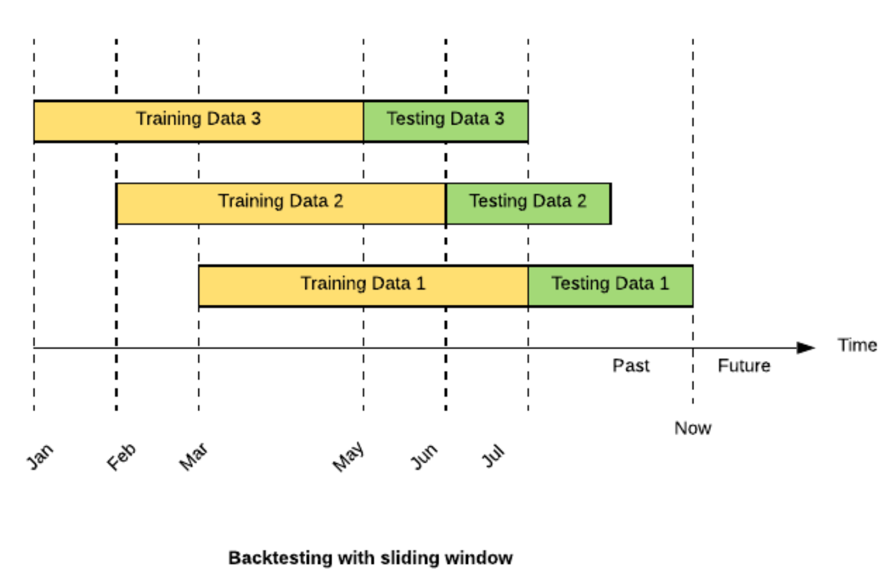
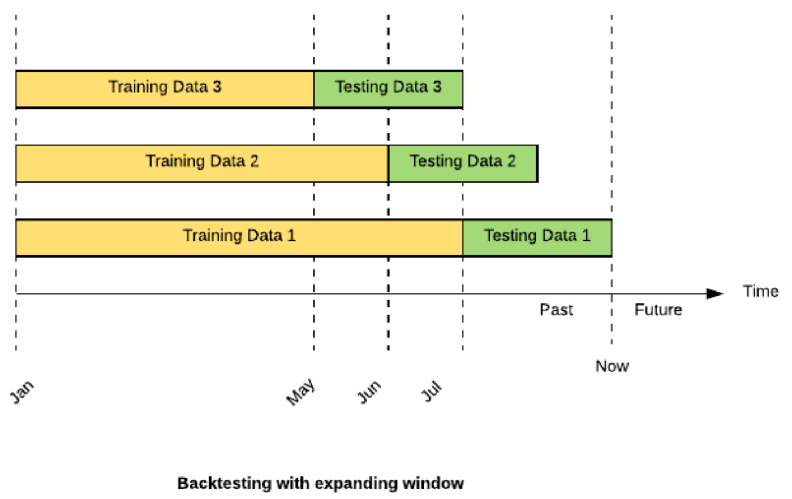

```{r setup, include=FALSE}
knitr::opts_chunk$set(echo = FALSE)
```

## Capital Asset Pricing Model - CAPM ^1^

CAPM é um modelo que calcula o retorno esperado de um ativo acima de um ativo "livre" de risco de mercado (geralmente um título público). Essa a taxa de retorno adicional é medido pelo coeficiente beta, de uma equação linear:

$R_{Mercado} = R_{RiskFree} + \beta(R_{Asset} - R_{RiskFree})$

No presente trabalho, serão realizadas diferentes metodologias para determinação do coeficiente $\beta$.

^1^ Definições adaptadas de: https://corporatefinanceinstitute.com/resources/knowledge/finance/what-is-capm-formula/

## Metodologia 1: Regressão Linear

Analisando bem a equação de CAPM, é possível ver uma similaridade com uma equação conhecida. 
Substitua o $R_{Mercado}$ por um $y$. Agora, substitua o $R_{RiskFree}$ por um $b$, o $\beta$ por um $a$ e o $(R_{Asset} - R_{RiskFree})$ por um $x$. Após essas substituições, temos a seguinte equação:

$R_{Mercado} = R_{RiskFree} + \beta(R_{Asset} - R_{RiskFree}) => y = b + ax$.

Essa equação talvez se apresente mais familiar: equação de primeiro grau (grau 1 e ordem 1) ou equação linear de ordem 1. 

Por ser uma equação linear do tipo $y = b + ax$, a primeira metodologia que surge é a de uma regressão linear.

Para tal podemos utilizar algumas metodologias para definir o coeficiente $\beta$, dado que os demais dados são dados conhecidos:

- $R_{RiskFree}$ = Retorno de um ativo de 'livre' de risco
- $R_{Mercado}$ = Retorno
- $R_{Asset}$ = Retorno do Ativo (ou carteira) a ser investido

A regressão linear é suficiente para poder definir essa $\beta$. Entretanto, fica a pergunta: esse $\beta$ é sempre igual ao longo do tempo?
Resposta: **Não**.

```{r}
library(tseries)
library(forecast)
library(quantmod)
library("fGarch")
library("rugarch")
library(xts)
library(BETS)

```

```{r}
# Renda fixa
Selic_Dia <- ?BETSget(code = "11")
rf <- xts(Selic_Dia$value*0.01, order.by = Selic_Dia$date)
par(mfrow=c(1,1))
plot(rf)
```

Ação Alpargatas
Correlação entre Ibovespa e Alpargatas é de 0.4425327, podendo ser considerada uma correlação mediana.
Com relação ao modelo linear o alfa estimado é de 0.0005838, mas estatisticamente igual a zero, já que o p-valor é  (maior do que 5%). Beta é 0.5861960, podendo assim ser considerada uma ação mais conservadora que o mercado.

```{r}
getSymbols("^BVSP")
getSymbols("ALPA4.SA")

# Excluindo os NAs
alpa = na.locf(ALPA4.SA$ALPA4.SA.Adjusted)
ibov = na.locf(BVSP$BVSP.Adjusted)

par(mfrow=c(3,1))
plot(alpa)
plot(ibov)

# Criação de log retorno
alpa <- diff(log(alpa), lag=1)[-1]
mercado <- diff(log(ibov), lag=1)[-1]

# Ajustando séries com mesmas datas de índices
init_date <- max(c(head(index(rf), n=1),head(index(alpa), n=1),head(index(mercado), n=1)))
rf_acao <- subset(rf, index(rf)<"2020-11-20" & index(rf)>=init_date)
alpa <- subset(alpa, index(alpa)<"2020-11-20" & index(alpa)>=init_date)
mercado <- subset(mercado, index(mercado)<"2020-11-20" & index(mercado)>=init_date)
rf_acao <- rf[index(alpa)]
alpa <- alpa[index(rf)]
mercado <- mercado[index(rf)]

# Conferindo se todas estão com mesmo número de linhas
nrow(alpa)
nrow(mercado)
nrow(x)

# Correlacao
cor(mercado, alpa)

plot(rf)
plot(alpa)
plot(mercado)

# CAPM tradicional 
alpa_CAPM <- alpa - rf
mercado_CAPM <- mercado - rf

alpa_fit = lm(alpa_CAPM ~ mercado_CAPM)
summary(alpa_fit)

MSE_alpa_estatico = mean((alpa_fit$fitted.values - alpa_CAPM)^2)
MAE_alpa_estatico = mean(abs(alpa_fit$fitted.values - alpa_CAPM))

par(mfrow=c(1,1))
plot(as.vector(mercado_CAPM),as.vector(alpa_CAPM),cex=0.8, col='darkblue',xlim = c(-0.15,0.1),ylim = c(-0.15,0.2),
     ylab='Alpargatas', xlab = 'Mercado',main='Market Model' )
abline(alpa_fit$coefficients, lwd=2)
```


```{r}
getSymbols("ITSA4.SA")
getSymbols("CVCB3.SA")
getSymbols("FLRY3.SA")

itausa = na.locf(ITSA4.SA$ITSA4.SA.Adjusted)
cvc = na.locf(CVCB3.SA$CVCB3.SA.Adjusted)
fleury = na.locf(FLRY3.SA$FLRY3.SA.Adjusted)

plot(itausa)
plot(cvc)
plot(fleury)
```


Serão então apresentados a seguir outros métodos para definição desse coeficiente.

## Modelo Linear Dinâmico

O modelo linear dinâmico é um modelo iterativo linear. Este modelo repete o modelo linear diversas vezes com diferentes amostras de maneira a calcular o $\beta$ diferente em cada instante de tempo.

Existem 2 técnicas de uso desse modelo:

- **Rolling ou Sliding Window:** amostra móvel em ambas as extremidades, sempre com o mesmo número de elementos em cada amostra
- **Expanding Window:** amostra onde o ponto inicial é fixado e o ponto final é incrementado, sempre com um número acumulativo de dados na amostra

Essas duas técnicas serão melhor explicadas a seguir

## Modelo Linear Dinâmico

Rolling window
O Beta só cruza uma vez em relação ao beta estático, podendo significar que talvez faá mais sentido uma análise com beta dinâmico para essa ação, já que o dinâmico não costuma oscilar em relação a um range próximo do estático.
```{r}
# Rolling window
init = round(nrow(mercado_CAPM)/2, 0)
out = nrow(mercado_CAPM) - init

betas = matrix(NA, out, 1)
for (t in 1:out){
  alpa_fit2 = lm(alpa_CAPM[t:(init+t)] ~ mercado_CAPM[t:(init+t)])
  
  betas[t]= alpa_fit2$coefficients[2]
}


ts.plot(betas, col=1, lwd=2, ylim=c(0.4,0.8), main='Rolling Betas')
abline(h=alpa_fit$coefficients[2], col=2, lty=2)
abline(h=1, col='gray', lty=1)
legend("bottom", col=1:2, lty=1,
       legend='Alpargatas',
       lwd = 2, cex=0.6, box.lty=2)
```

Expand Window
Caso utilizamos um expand window e as informações antigas não foram descartadas, podemos perceber que historicamente os betas indicam que a Alpargatas tem o histórico de ser uma ação defensiva, mas com os ultimos acontecimentos do COVID seu beta acabou subindo de forma bem significativa. Essa análise da amostra inteira podemos ver bem esse efeito.   
```{r}
# Expand window
init = round(nrow(mercado_CAPM)/5, 0)
out = nrow(mercado_CAPM) - init

betas = matrix(NA, out, 1)
for (t in 1:out){
  alpa_fit2 = lm(alpa_CAPM[1:(init+t)] ~ mercado_CAPM[1:(init+t)])
  betas[t]= alpa_fit2$coefficients[2]
}


ts.plot(betas, col=1, lwd=2, ylim=c(0.4,0.8), main='Rolling Betas')
abline(h=alpa_fit$coefficients[2], col=2, lty=2)
abline(h=1, col='gray', lty=1)
legend("bottom", col=1:2, lty=1,
       legend='Alpargatas',
       lwd = 2, cex=0.6, box.lty=2)
```


CAPM com modelo de volatilidade
```{r}

spec <- auto.arima(alpa_CAPM, trace = TRUE, ic="aic",stepwise = FALSE) # ARMA(1,0,1) melhor modelo pelo criterio aic

fit = list()
specs = list()
AICs = matrix(NA, 16, 5)
colnames(AICs) = c('Arch-Order', 'Garch-Order','Model', 'Distr.', 'BIC')
rownames(AICs) = paste("Modelo", 1:64, sep = " ")
dist = c('norm', 'std')
model = c('sGARCH', 'eGARCH')

k = 1

for (i in 1:2){
  for (j in 1:2){
    for (l in 1:length(dist)){
      for (m in 1:length(model)){
        print(c(i,j,l,m))
        specs[[k]] = ugarchspec(mean.model = list(armaOrder = c(1,1)),
                                variance.model = list(model=model[m], garchOrder=c(i,j)),
                                distribution.model = dist[l])
        
        fit[[k]] = ugarchfit(specs[[k]], data = mercado_CAPM, solver = 'hybrid')
        
        AICs[k,] = c(i,j, model[m], dist[l],  abs(round(infocriteria(fit[[k]])[1],3)))
        
        k = k + 1
        
      }
    }
  }
}

best <- which(AICs[,5] == max(AICs[,5]), arr.ind = TRUE)
AICs[best,]
spec <- ugarchspec(mean.model = list(armaOrder = c(1,1)),
                   variance.model = list(model="sGARCH", garchOrder=c(2,1)),
                   distribution.model = "norm")

garch_mercado = ugarchfit(spec, data = mercado_CAPM)

temp1 = alpa_CAPM + mercado_CAPM
temp2 = alpa_CAPM - mercado_CAPM

garch_mais = ugarchfit(spec, data = temp1)
garch_menos = ugarchfit(spec, data = temp2)

var_mercado = garch_mercado@fit$sigma^2
var_mais    = garch_mais@fit$sigma^2
var_menos   = garch_menos@fit$sigma^2

tvp_beta = (var_mais - var_menos)/(4*var_mercado)

ts.plot(tvp_beta, col=1, ylab='Alpargatas', main='Time-Varying Beta', lwd=1)
abline(h=itau_fit$coefficients[2], lty=2, lwd=2, col=2)


# Performance via Backtest

fitted = rep(NA, nrow(alpa_CAPM))
erro = rep(NA, nrow(alpa_CAPM))

for (t in 1:nrow(alpa_CAPM)){
  fitted[t] = tvp_beta[t]*mercado_CAPM[t]
  erro[t]   = alpa_CAPM[t] - fitted[t] 
}

MSE_beta_garch = mean(erro^2)
MAE_beta_garch = mean(abs(erro))

MAE_beta_garch/MAE_alpa_estatico

MSE_beta_garch/MAE_alpa_estatico
```
Modelo com beta variando através do GARCH performa melhor que o beta estático!

### Rolling ou Sliding Window

A técnica de Rolling Window (também conhecida como Sliding Window) tem por princípio, realizar $n$ regressões para uma 'janela' móvel de $m$ observações. Esse modelo realiza um processo iterativo, onde em cada iteração, o $\beta$ é calculado com base em uma regressão linear que considera os $m$ dias anteriores. 

Neste caso, o primeiro $\beta$ é calculado inicialmente para o dia $m+1$, usando os dados dos $m$ dias anteriores. 

Na próxima iteração a 'janela' de $m$ dias é deslocada em 1 dia e um novo $\beta$ é calculado para o dia seguinte ($m+2$).

Esse processo é repetido até que a amostra dos últimos $m$ dias seja utilizada.

Desta forma, são estimados os $\beta s$ que 'variam ao longo do tempo', sempre com amostras distintas entre si, levando assim a .



## Modelo Linear Dinâmico

### Expanding Window

A técnica de Expanding Windows é parecida com a técnica de Rolling Window com uma pequena diferença. Essa técnica também é baseada em um modelo linear que é repetido iterativamente com uma nova amostra dos dados, entretanto, nesta técnica, o tamanho da amostra não é fixo. 
Diferente da técnica anterior, a janela de amostra é aumentada a cada nova iteração, conforme apresentado abaixo:

Na primeira iteração, a amostra da técnica de Expanding Window é identica a primeira amostra da técnica Rolling Window, ou seja, o valor de $\beta$ para o dia $m+1$ é calculado sobre uma amostra de $m$ dias.

Na seguinte iteração, o $\beta$ é agora calculado sobre um amostra de $m+1$ dias, onde o início da amostra permanece inalterado (dia 1 da série) e o fim da amostra ocorre 1 dia após.

Seguindo a mesma lógica, são feitas então as demais iterações, onde a cada nova iteração a amostra é aumentada em 1 dia (inicio no 1^o^ dia e término no dia anterior ao dia de interesse).

Um fato relevante é que na última amostra, todos os dados da série são usados e portanto esse último $\beta$ é igual ao $\beta$ do Modelo Linear Estático. Sendo assim, ao plotar um gráfico de $dias$ vs. $\beta$ + linha $\beta_{estático}$, ver-se-á um gráfico onde o $\beta$ tende a se aproximar cada vez mas do valor estático ao final da série.


```{r}


```



^2^ https://eng.uber.com/backtesting-at-scale/
Colocar ações de antes de 2007

## Betas Variantes no tempo (Time-Varying Betas)

### Tsay - An Intr Analysis of Financial Data With R - 5.3.1

O modelo de Time-Varying Betas do livro Tsay, considera o $\beta$ como um coeficiente variante no tempo. 
Nesse caso, é feita também uma aproximação em que não é considerada como variável independente o excesso retorno $R_{Asset} - R_{RiskFree}$, mas sim o $R_{Asset}$.
Sendo assim a equação de CAPM é simplificada para $R_{Mercado} = R_{RiskFree} + \beta R_{Asset}$.

Esse coeficiente é calculado com base na correlação entre os valores de $R_{Asset}$ e $R_{RiskFree}$ ao longo do tempo.

Para esse cálculo, é utilizado o princípio estatítico:

$Var(x_t + y_t) = Var(x_t) + 2Cov(x_t , y_t) + Var(y_t)$
$Var(x_t - y_t) = Var(x_t) - 2Cov(x_t , y_t) + Var(y_t)$

Que permite isolar a covariância e calculá-la com base nas variâncias combinadas dos ativos:

$Cov(x_t , y_t) = Var(x_t + y_t) − Var(x_t − y_t) \over 4$

Como a variância é o qua

## Slide with Bullets

- Bullet 1
- Bullet 2
- Bullet 3


## Slide with R Output

```{r cars, echo = TRUE}
summary(cars)
```

## Slide with Plot

```{r pressure}
plot(pressure)
```

