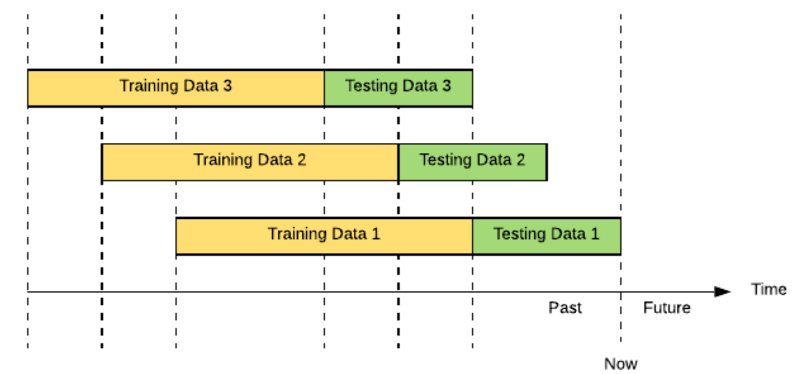
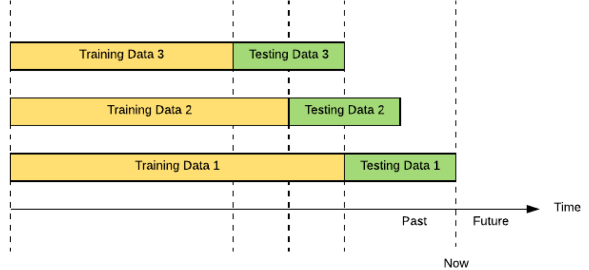

```{r setup, include=FALSE}
knitr::opts_chunk$set(echo = FALSE,warning = FALSE,
                      message = FALSE, options(scipen=999))
```

<style type="text/css">
  body{
  font-size: 12pt;
  }
  h1.title {
  font-size: 38px;
  color: DarkBlue;
  }
  h1 { /* Header 1 */
    font-size: 38px;
    color: DarkBlue;
  }
  h2 { /* Header 2 */
      font-size: 34px;
    color: DarkBlue;
  }
  h3 { /* Header 3 */
    font-size: 30px;
    <!-- font-family: "Times New Roman", Times, serif; -->
    color: DarkBlue;
  }
  code.r{ /* Code block */
      font-size: 12px;
  }
  pre { /* Code block - determines code spacing between lines */
      font-size: 12px;
  }
</style>

## Objetivo

O objetivo dessa apresentação é analisar o valor obtido de $\beta$, do modelo CAPM para 4 diferentes ativos usando 3 diferentes métodos para obtenção desse coefientes.

Na análise realizada, foram comparados os $\beta s$ para diferentes ações utilizando os métodos descritos nos slides anteriores. Após o cálculo desses coeficientes foram feitas análises sobre os valores obtidos para cada ação. Essas análises foram:

- **Gráfica:** comparando os valores de $\beta$ para os 3 métodos ao longo do tempo
- **Erro:** comparando os valores de $\beta$ calculados vs. os valores de $\beta$ obtidos
- **Backtest:** comparando os valores de $\beta$ dos 3 métodos para períodos futuros 

## Capital Asset Pricing Model - CAPM ^1^ {.bigger}

CAPM é um modelo que calcula o retorno esperado de um ativo acima de um ativo "livre" de risco de mercado (geralmente um título público). Essa a taxa de retorno adicional é medido pelo coeficiente beta, de uma equação linear:

$\small R_{Mercado} = R_{RiskFree} + \beta(R_{Asset} - R_{RiskFree})$

No presente trabalho, serão realizadas diferentes metodologias para determinação do coeficiente $\beta$.

^1^ Definições adaptadas de: https://corporatefinanceinstitute.com/resources/knowledge/finance/what-is-capm-formula/

## Metodologia 1: Regressão Linear

Analisando bem a equação de CAPM, é possível ver uma similaridade com uma equação conhecida. 
Substitua o $R_{Mercado}$ por um $y$. Agora, substitua o $\small R_{RiskFree}$ por um $b$, o $\beta$ por um $a$ e o $\small (R_{Asset} - R_{RiskFree})$ por um $x$. Após essas substituições, temos a seguinte equação:

$\small R_{Mercado} = R_{RiskFree} + \beta(R_{Asset} - R_{RiskFree}) => y = b + ax$.

Essa equação talvez se apresente mais familiar: equação de primeiro grau (grau 1 e ordem 1) ou equação linear de ordem 1. 

Por ser uma equação linear do tipo $\small y = b + ax$, a primeira metodologia que surge é a de uma regressão linear.

Para tal podemos utilizar algumas metodologias para definir o coeficiente $\beta$, dado que os demais dados são dados conhecidos:

- $\small R_{RiskFree}$ = Retorno de um ativo de 'livre' de risco
- $\small R_{Mercado}$ = Retorno
- $\small R_{Asset}$ = Retorno do Ativo (ou carteira) a ser investido

A regressão linear é suficiente para poder definir essa $\beta$. Entretanto, fica a pergunta: esse $\beta$ é sempre igual ao longo do tempo?
Resposta: **Não**.

Serão então apresentados a seguir outros métodos para definição desse coeficiente.

## Modelo Iterativo

O modelo iterativo é um modelo iterativo linear. Este modelo repete o modelo linear diversas vezes com diferentes amostras de maneira a calcular o $\beta$ diferente em cada instante de tempo.

Existem 2 técnicas de uso desse modelo:

- **Rolling ou Sliding Window:** amostra móvel em ambas as extremidades, sempre com o mesmo número de elementos em cada amostra
- **Expanding Window:** amostra onde o ponto inicial é fixado e o ponto final é incrementado, sempre com um número acumulativo de dados na amostra

Essas duas técnicas serão melhor explicadas a seguir

## Rolling ou Sliding Window {.smaller}

A técnica de Rolling Window (também conhecida como Sliding Window) tem por princípio, realizar $n$ regressões para uma 'janela' móvel de $m$ observações. Esse modelo realiza um processo iterativo, onde em cada iteração, o $\beta$ é calculado com base em uma regressão linear que considera os $m$ dias anteriores. 

Neste caso, o primeiro $\beta$ é calculado inicialmente para o dia $\small m+1$, usando os dados dos $m$ dias anteriores. 

Na próxima iteração a 'janela' de $\small m$ dias é deslocada em 1 dia e um novo $\beta$ é calculado para o dia seguinte ($\small m+2$).

Esse processo é repetido até que a amostra dos últimos $\small m$ dias seja utilizada.

Desta forma, são estimados os $\beta s$ que 'variam ao longo do tempo', sempre com amostras distintas entre si, levando assim a .

##### Rolling Window Example^2^

```{r fig.align = 'center'}


```
<!--  -->

## Expanding Window {.smaller}

A técnica de Expanding Windows é parecida com a técnica de Rolling Window com uma pequena diferença. Essa técnica também é baseada em um modelo linear que é repetido iterativamente com uma nova amostra dos dados, entretanto, nesta técnica, o tamanho da amostra não é fixo. 
Diferente da técnica anterior, a janela de amostra é aumentada a cada nova iteração, conforme apresentado abaixo:

Na primeira iteração, a amostra da técnica de Expanding Window é identica a primeira amostra da técnica Rolling Window, ou seja, o valor de $\beta$ para o dia $\small m+1$ é calculado sobre uma amostra de $\small m$ dias.

Na seguinte iteração, o $\beta$ é agora calculado sobre um amostra de $\small m+1$ dias, onde o início da amostra permanece inalterado (dia 1 da série) e o fim da amostra ocorre 1 dia após.

Seguindo a mesma lógica, são feitas então as demais iterações, onde a cada nova iteração a amostra é aumentada em 1 dia (inicio no 1^o^ dia e término no dia anterior ao dia de interesse).

Um fato relevante é que na última amostra, todos os dados da série são usados e portanto esse último $\beta$ é igual ao $\beta$ do Modelo Linear Estático. Sendo assim, ao plotar um gráfico de $\small dias$ vs. $\beta$ + linha $\beta_{estático}$, ver-se-á um gráfico onde o $\beta$ tende a se aproximar cada vez mais do valor estático ao final da série.

##### Expanding Window Example^2^

```{r fig.align = 'center'}
# print("Expanding Window Example")

```


<!-- {width=50%} -->

^2^Imagens retiradas de: https://eng.uber.com/backtesting-at-scale/
Colocar ações de antes de 2007

## Betas Variantes no tempo (Time-Varying Betas) {.smaller}

### Tsay - An Intr Analysis of Financial Data With R - 5.3.1

O modelo de Time-Varying Betas do livro Tsay, considera o $\beta$ como um coeficiente variante no tempo. 
Nesse caso, é feita também uma aproximação em que não é considerada como variável independente o excesso retorno $\small R_{Asset} - R_{RiskFree}$, mas sim o $\small R_{Asset}$.
Sendo assim a equação de CAPM é simplificada para $\small R_{Mercado} = R_{RiskFree} + \beta R_{Asset}$.

Esse coeficiente é calculado com base na correlação entre os valores de $\small R_{Asset}$ e $\small R_{RiskFree}$ ao longo do tempo.

Para esse cálculo, é utilizado o princípio estatítico:

$\small Var(x_t + y_t) = Var(x_t) + 2Cov(x_t , y_t) + Var(y_t)$
$\small Var(x_t - y_t) = Var(x_t) - 2Cov(x_t , y_t) + Var(y_t)$

Que permite isolar a covariância e calculá-la com base nas variâncias combinadas dos ativos:

$\small Cov(x_t , y_t) = {Var(x_t + y_t) − Var(x_t − y_t) \over 4}$

Dado que a volatilidade $\sigma_{x,t}$ é dada pela $\sqrt{var(x_t)}$ em um dado período, podemos então lançar mão de modelos GARCH para cálculo das variâncias ao longo do tempo e assim, calcular a Covariância. Aqui, será assumido um modelo GARCH(1,1).

De posse do valores de Covariância, temos então que calcular a Correlação entre $x_t$ e $y_t$.

$\small Corr(x_t,y_t) = {Cov(x,y) \over Var(x)Var(y)} => Corr(x_t,y_t) = {Var(x_t + y_t) − Var(x_t − y_t) \over 4 \sqrt{Var(x)}\sqrt{Var(y)}}$

## Importando as cotações históricas

As análises usaram 4 papéis negociados na bolsa brasileira B3 em relação ao título Tesouro Selic do Governo Federal. Os papéis são:

- Companhia Vale do Rio Doce - VALE3.SA
  - Companhia de Extração Mineral
- Petrobrás - PETR4.SA
  - Companhia de Exploração de Petróleo
- Via  Varejo - VVAR3.SA
  - Companhia do ramo de consumo varejista
- CEMIG - CMIG4.SA
  - Companhia do ramo de energia
- IBOVESPA - ^BVSP

```{r biblios}
source('funcoes_v2.R')

require(scales)
require(quantmod)
require(tidyverse)
require(ggplot2)
require(Amelia)
require(reshape2)
require(ggthemes) 
require(plyr)
require(urca)
require(forecast)
require(tseries)
require("fGarch")
require("rugarch")
require(fDMA)
library(doParallel)
library(xts)
library(BETS)
library(tibbletime)
library(dplyr)
library(kableExtra)

```

## Ações - Petrobrás

```{r importando_petr}
# Importando as ações
petr <- importa_retorno('PETR4.SA')

# getSymbols('PETR4.SA')
# 
# petr2 <- na.locf(PETR4.SA$PETR4.SA.Adjusted)
# petr[[1]] %>% nrow()
# petr[[2]] %>% nrow()
# petr2 %>% nrow()

summary(petr[[1]])

# glimpse(petr[[1]])

par(mfrow = c(2,1))
plot(petr[[1]], main = 'Preço PETR4.SA')
plot(petr[[2]], main = 'Retorno PETR4.SA')
```

## Ações - Vale do Rio Doce

```{r importando_vale}
vale <- importa_retorno('VALE3.SA')

# getSymbols('VALE3.SA')
# 
# vale2 = na.locf(VALE3.SA$VALE3.SA.Adjusted)
# vale2 %>% nrow()
# vale[[1]] %>% nrow()
# vale[[2]] %>% nrow()

summary(vale[[1]])
# glimpse(vale[[1]])

par(mfrow = c(2,1))
plot(vale[[1]], main = 'Preço VALE3.SA')
plot(vale[[2]], main = 'Retorno VALE3.SA')
```

## Ações - Via Varejo

```{r importando_via_var}
vvar <- importa_retorno('VVAR3.SA')

summary(vvar[[1]])

# vvar[[2]] %>% nrow()


par(mfrow = c(2,1))
plot(vvar[[1]], main = 'Preço VVAR3.SA')
plot(vvar[[2]], main = 'Retorno VVAR3.SA')
```


## Ações - CEMIG

```{r importando_cemig}
cmig <- importa_retorno('CMIG4.SA')

summary(cmig[[1]])

par(mfrow = c(2,1))
plot(cmig[[1]], main = 'Preço CMIG4.SA')
plot(cmig[[2]], main = 'Retorno CMIG4.SA')

```

## Ações - Ibovespa

```{r importando_ibov}
ibov <- importa_retorno('^BVSP')

summary(ibov[[1]])
# getSymbols('^BVSP')
# 
# ibov2 <- na.locf(BVSP$BVSP.Adjusted)
# 
# ibov2 %>% nrow()
# ibov[[2]] %>% nrow()
# ibov[[1]] %>% nrow()

par(mfrow = c(2,1))
plot(ibov[[1]], main = 'Pontos IBOVESPA')
plot(ibov[[2]], main = 'Retorno IBOVESPA')

# ipca <- BETSget(433, from = "2007-01-01", data.frame = FALSE, frequency = 'daily')
# 
# x <- BETSsearch()
# 
# summary(ipca)
# 
# x %>% dplyr::filter(stringr::str_detect(description,"IPCA"))

```

## Calculando Beta Linear Estático - Petrobrás {.smaller}

```{r}
# fazendo com que todas as séries tenham as mesmas datas
# nrow(petr[[2]])
# nrow(vale[[2]])
# nrow(vvar[[2]])
# nrow(cmig[[2]])
# nrow(ibov[[2]])
# 
# nrow(petr_filtered)
# nrow(vale_filtered)
# nrow(vvar_filtered)
# nrow(cmig_filtered)
# nrow(ibov_filtered)

petr_filtered <- datas_comuns_5(petr[[2]],vale[[2]],vvar[[2]],cmig[[2]],ibov[[2]])
ibov_filtered <- datas_comuns_5(ibov[[2]],petr[[2]],vale[[2]],vvar[[2]],cmig[[2]])

vale_filtered <- datas_comuns_5(vale[[2]],petr[[2]],vvar[[2]],cmig[[2]],ibov[[2]])

vvar_filtered <- datas_comuns_5(vvar[[2]],vale[[2]],petr[[2]],cmig[[2]],ibov[[2]])

cmig_filtered <- datas_comuns_5(cmig[[2]],vvar[[2]],vale[[2]],petr[[2]],ibov[[2]])
```


```{r r_est_petr, results=FALSE}

# # buscando datas duas séries
# petr_idx <- petr[[2]] %>% index() 
# ibov_idx <- ibov[[2]] %>% index()
# # buscando datas que não existem na outra série
# # ibov_idx[ibov_idx %ni% petr_idx]
# # petr_idx[petr_idx %ni% ibov_idx]
# 
# # Filtrando somente pelas datas que existem nas duas séries
# petr_filtered <- petr[[2]][petr_idx %in% ibov_idx]
# ibov_filtered <- ibov[[2]][ibov_idx %in% petr_idx]

# Filtrando somente pelas datas que existem nas duas séries
titulos <- c('PETROBRAS','IBOVESPA','Modelo de Mercado')

papel1 <- petr[[2]]
papel2 <- ibov[[2]]

papel1_filtered <- datas_comuns(papel1,papel2)
papel2_filtered <- datas_comuns(papel2,papel1)
# selic_filtered <- datas_comuns(rf,papel2_filtered)

papel1_fit = lm(papel1_filtered ~ papel2_filtered)
summary(papel1_fit)

beta_petr <- papel1_fit$coefficients[2]

MSE_petr_estatico = mean((papel1_fit$fitted.values - papel1_filtered)^2)
MAE_petr_estatico = mean(abs(papel1_fit$fitted.values - papel1_filtered))

par(mfrow=c(1,1))
plot(as.vector(papel2_filtered),as.vector(papel1_filtered),cex=0.8, col='darkblue',xlim = c(-0.15,0.1),ylim = c(-0.15,0.2),
     ylab=titulos[1], xlab = titulos[2],main=titulos[3])
abline(papel1_fit$coefficients, lwd=2)

```

O valor do $\beta_{est_{petr}}$ é `r beta_petr`.


## Calculando Beta Linear Estático - Vale {.smaller}

```{r r_est_vale, results=FALSE}

# Filtrando somente pelas datas que existem nas duas séries
titulos <- c('VALE','IBOVESPA','Modelo de Mercado')

papel1 <- vale[[2]]
papel2 <- ibov[[2]]

papel1_filtered <- datas_comuns(papel1,papel2)
papel2_filtered <- datas_comuns(papel2,papel1)

papel1_fit = lm(papel1_filtered ~ papel2_filtered)
summary(papel1_fit)

beta_vale <- papel1_fit$coefficients[2]

MSE_vale_estatico = mean((papel1_fit$fitted.values - papel1_filtered)^2)
MAE_vale_estatico = mean(abs(papel1_fit$fitted.values - papel1_filtered))

par(mfrow=c(1,1))
plot(as.vector(papel2_filtered),as.vector(papel1_filtered),cex=0.8, col='darkblue',xlim = c(-0.15,0.1),ylim = c(-0.15,0.2),
     ylab=titulos[1], xlab = titulos[2],main=titulos[3])
abline(papel1_fit$coefficients, lwd=2)

```

O valor do $\beta_{est_{vale}}$ é `r beta_vale`.

## Calculando Beta Linear Estático - Via Varejo {.smaller}

```{r r_est_vvar, results=FALSE}

# Filtrando somente pelas datas que existem nas duas séries
titulos <- c('VIA VAREJO','IBOVESPA','Modelo de Mercado')

papel1 <- vvar[[2]]
papel2 <- ibov[[2]]

papel1_filtered <- datas_comuns(papel1,papel2)
papel2_filtered <- datas_comuns(papel2,papel1)

papel1_fit = lm(papel1_filtered ~ papel2_filtered)
summary(papel1_fit)

beta_vvar <- papel1_fit$coefficients[2]

MSE_vvar_estatico = mean((papel1_fit$fitted.values - papel1_filtered)^2)
MAE_vvar_estatico = mean(abs(papel1_fit$fitted.values - papel1_filtered))

par(mfrow=c(1,1))
plot(as.vector(papel2_filtered),as.vector(papel1_filtered),cex=0.8, col='darkblue',xlim = c(-0.15,0.1),ylim = c(-0.15,0.2),
     ylab=titulos[1], xlab = titulos[2],main=titulos[3])
abline(papel1_fit$coefficients, lwd=2)

```

O valor do $\beta_{est_{vvar}}$ é `r beta_vvar`.


## Calculando Beta Linear Estático - Cemig {.smaller}

```{r r_est_cemig, results=FALSE}

# Filtrando somente pelas datas que existem nas duas séries
titulos <- c('CEMIG','IBOVESPA','Modelo de Mercado')

papel1 <- cmig[[2]]
papel2 <- ibov[[2]]

papel1_filtered <- datas_comuns(papel1,papel2)
papel2_filtered <- datas_comuns(papel2,papel1)

papel1_fit = lm(papel1_filtered ~ papel2_filtered)
summary(papel1_fit)

beta_cmig <- papel1_fit$coefficients[2]

MSE_cmig_estatico = mean((papel1_fit$fitted.values - papel1_filtered)^2)
MAE_cmig_estatico = mean(abs(papel1_fit$fitted.values - papel1_filtered))

par(mfrow=c(1,1))
plot(as.vector(papel2_filtered),as.vector(papel1_filtered),cex=0.8, col='darkblue',xlim = c(-0.15,0.1),ylim = c(-0.15,0.2),
     ylab=titulos[1], xlab = titulos[2],main=titulos[3])
abline(papel1_fit$coefficients, lwd=2)

```

O valor do $\beta_{est_{cmig}}$ é `r beta_cmig`.

## Betas Lineares Estáticos - Resumo

```{r resumo_betas}

betas <- tibble(Petrobras = round(beta_petr,3),
                Vale = round(beta_vale,3),
                Via_Varejo = round(beta_vvar,3),
                Cemig = round(beta_cmig,3))
                                                                               
betas %>% kbl() %>% kable_styling()

# DT::datatable(betas)

```

ANALISAR


## Calculando Beta Linear Iterativo (Rolling Window)

```{r roling, cache=TRUE}
# init = round(nrow(ibov[[2]])/2, 0)
# out = nrow(ibov[[2]]) - init

petr_filtered <- datas_comuns_5(petr[[2]],vale[[2]],vvar[[2]],cmig[[2]],ibov[[2]])
ibov_filtered <- datas_comuns_5(ibov[[2]],petr[[2]],vale[[2]],vvar[[2]],cmig[[2]])

vale_filtered <- datas_comuns_5(vale[[2]],petr[[2]],vvar[[2]],cmig[[2]],ibov[[2]])

vvar_filtered <- datas_comuns_5(vvar[[2]],vale[[2]],petr[[2]],cmig[[2]],ibov[[2]])

cmig_filtered <- datas_comuns_5(cmig[[2]],vvar[[2]],vale[[2]],petr[[2]],ibov[[2]])


# petr[[2]][which.max(petr[[2]])]
# 
# petr_filtered[which.max(petr_filtered)]
# 
# betas_rol_mat[,1][which.max(betas_rol_mat[,1])]

init = round(nrow(ibov_filtered)/2, 0)
out = nrow(ibov_filtered) - init


betas_rol = tibble(Petr = NA, Vale = NA, VVar = NA, CMIG = NA)
for (t in 1:out){
  petr_fit2 = lm(petr_filtered[t:(init+t)] ~ ibov_filtered[t:(init+t)])
  vale_fit2 = lm(vale_filtered[t:(init+t)] ~ ibov_filtered[t:(init+t)])
  vvar_fit2 = lm(vvar_filtered[t:(init+t)] ~ ibov_filtered[t:(init+t)])
  cmig_fit2 = lm(cmig_filtered[t:(init+t)] ~ ibov_filtered[t:(init+t)])

  betas_rol = betas_rol %>% bind_rows(
                                      tibble(Petr = petr_fit2$coefficients[2],
                                             Vale = vale_fit2$coefficients[2],
                                             VVar = vvar_fit2$coefficients[2],
                                             CMIG = cmig_fit2$coefficients[2])
                                      )

}

betas_rol <- betas_rol %>% na.omit()

betas_rol_mat <- matrix(c(betas_rol$Petr,betas_rol$Vale,betas_rol$VVar,betas_rol$CMIG), ncol = 4)

plot.ts(betas_rol_mat, col=1:4, lwd=2, ylim=c(0,2), main='Rolling Betas',ylab = "Beta", plot.type = 'single')
abline(h=betas$Petrobras, col=1, lty=2)
abline(h=betas$Vale, col=2, lty=2)
abline(h=betas$Via_Varejo, col=3, lty=2)
abline(h=betas$Cemig, col=4, lty=2)
abline(h=1, col='gray', lty=1)
legend("bottom", col=1:4, lty=1,
       legend=c('Petrobrás','Vale','Via Varejo','CEMIG'),
       lwd = 2, cex=0.6, box.lty=2)


# betas_rol_mat <- xts(zoo(betas_rol_mat,as.Date(index(cmig_filtered))),order.by = as.Date(index(cmig_filtered)))
# 
# betas_rol_mat <- zoo(betas_rol_mat,as.Date(index(cmig_filtered)))

# plot(betas_rol_mat, col=1:4, lwd=2, ylim=c(0,2), main='Rolling Betas',ylab = "Beta")
# abline(h=betas$Petrobras, col=1, lty=2)
# abline(h=betas$Vale, col=2, lty=2)
# abline(h=betas$Via_Varejo, col=3, lty=2)
# abline(h=betas$Cemig, col=4, lty=2)
# abline(h=1, col='gray', lty=1)
# legend("bottom", col=1:4, lty=1,
#        legend=c('Petrobrás','Vale','Via Varejo','CEMIG'),
#        lwd = 2, cex=0.6, box.lty=2)

par(mfrow=c(2,2))
plot.ts(betas_rol_mat[,1], col=1, lwd=2, 
        ylim=c(min(betas_rol_mat[,1],betas$Petrobras)*0.9,
               max(betas_rol_mat[,1],betas$Petrobras)*1.1), 
        main='Petrobras',
        ylab = "Beta",
     xy.lines = F) 
abline(h=betas$Petrobras, col=2, lty=4, lwd = 3)
abline(h=1, col='gray', lty=1)


plot.ts(betas_rol_mat[,2], col=1, lwd=2, 
        ylim=c(min(betas_rol_mat[,2],betas$Vale)*0.9,
               max(betas_rol_mat[,2],betas$Vale)*1.1), 
        main='Vale',
        ylab = "Beta")
abline(h=betas$Vale, col='red', lty=2)
abline(h=1, col='gray', lty=1)
# legend("bottom", col=1, lty=1,
#        legend=c('Vale'),
#        lwd = 2, cex=0.6, box.lty=2)

plot.ts(betas_rol_mat[,3], col=1, lwd=2,
        ylim=c(min(betas_rol_mat[,3],betas$Via_Varejo)*0.9,
               max(betas_rol_mat[,3],betas$Via_Varejo)*1.1), 
        main='Via Varejo',
        ylab = "Beta") 
abline(h=betas$Via_Varejo, col='red', lty=2)
abline(h=1, col='gray', lty=1)
# legend("bottom", col=1, lty=1,
#        legend=c('Via Varejo'),
#        lwd = 2, cex=0.6, box.lty=2)

plot.ts(betas_rol_mat[,4], col=1, lwd=2, 
        ylim=c(min(betas_rol_mat[,4],betas$Cemig)*0.9,
               max(betas_rol_mat[,4],betas$Cemig)*1.1), 
        main='Cemig',
        ylab = "Beta") 
abline(h=betas$Cemig, col='red', lty=2)
abline(h=1, col='gray', lty=1)
# legend("bottom", col=1, lty=1,
#        legend=c('CEMIG'),
#        lwd = 2, cex=0.6, box.lty=2)
```

## Calculando Beta Linear Iterativo (Expanding Window)

```{r expanding, cache=T}
# init = round(nrow(ibov[[2]])/2, 0)
# out = nrow(ibov[[2]]) - init

# petr_filtered <- datas_comuns_5(petr[[2]],vale[[2]],vvar[[2]],cmig[[2]],ibov[[2]])
# ibov_filtered <- datas_comuns_5(ibov[[2]],petr[[2]],vale[[2]],vvar[[2]],cmig[[2]])
# 
# vale_filtered <- datas_comuns_5(vale[[2]],petr[[2]],vvar[[2]],cmig[[2]],ibov[[2]])
# 
# vvar_filtered <- datas_comuns_5(vvar[[2]],vale[[2]],petr[[2]],cmig[[2]],ibov[[2]])
# 
# cmig_filtered <- datas_comuns_5(cmig[[2]],vvar[[2]],vale[[2]],petr[[2]],ibov[[2]])

init = round(nrow(ibov_filtered)/2, 0)
out = nrow(ibov_filtered) - init

betas_exp = tibble(Petr = NA, Vale = NA, VVar = NA, CMIG = NA)
for (t in 1:out){
  petr_fit2 = lm(petr_filtered[1:(init+t)] ~ ibov_filtered[1:(init+t)])
  vale_fit2 = lm(vale_filtered[1:(init+t)] ~ ibov_filtered[1:(init+t)])
  vvar_fit2 = lm(vvar_filtered[1:(init+t)] ~ ibov_filtered[1:(init+t)])
  cmig_fit2 = lm(cmig_filtered[1:(init+t)] ~ ibov_filtered[1:(init+t)])

  betas_exp = betas_exp %>% bind_rows(
                                      tibble(Petr = petr_fit2$coefficients[2],
                                             Vale = vale_fit2$coefficients[2],
                                             VVar = vvar_fit2$coefficients[2],
                                             CMIG = cmig_fit2$coefficients[2])
                                      )

}

betas_exp <- betas_exp %>% na.omit()

betas_exp_mat <- matrix(c(betas_exp$Petr,betas_exp$Vale,betas_exp$VVar,betas_exp$CMIG), ncol = 4)


############################ Trocar os títulos para o nome da ação e verificar a convergência do último gráfico 

# betas_exp_mat <- xts(zoo(betas_exp_mat,as.Date(index(cmig_filtered))),order.by = as.Date(index(cmig_filtered)))

plot.ts(betas_exp_mat, col=1:4, lwd=2, ylim=c(0,2), main='Rolling Betas',ylab = "Beta",plot.type = "single")
abline(h=betas$Petrobras, col=1, lty=2)
abline(h=betas$Vale, col=2, lty=2)
abline(h=betas$Via_Varejo, col=3, lty=2)
abline(h=betas$Cemig, col=4, lty=2)
abline(h=1, col='gray', lty=1)
legend("bottom", col=1:4, lty=1,
       legend=c('Petrobrás','Vale','Via Varejo','CEMIG'),
       lwd = 2, cex=0.6, box.lty=2)

par(mfrow=c(2,2))
plot.ts(betas_exp_mat[,1], col=1, lwd=2, 
        ylim=c(min(betas_exp_mat[,1],betas$Petrobras)*0.9,
               max(betas_exp_mat[,1],betas$Petrobras)*1.1), 
        main='Petrobras',
        ylab = "Beta") 
abline(h=betas$Petrobras, col='red', lty=2)
abline(h=1, col='gray', lty=1)


plot.ts(betas_exp_mat[,2], col=1, lwd=2, 
        ylim=c(min(betas_exp_mat[,2],betas$Vale)*0.9,
               max(betas_exp_mat[,2],betas$Vale)*1.1), 
        main='Vale',
        ylab = "Beta")
abline(h=betas$Vale, col='red', lty=2)
abline(h=1, col='gray', lty=1)
# legend("bottom", col=1, lty=1,
#        legend=c('Vale'),
#        lwd = 2, cex=0.6, box.lty=2)

plot.ts(betas_exp_mat[,3], col=1, lwd=2,
        ylim=c(min(betas_exp_mat[,3],betas$Via_Varejo)*0.9,
               max(betas_exp_mat[,3],betas$Via_Varejo)*1.1), 
        main='Via Varejo',
        ylab = "Beta") 
abline(h=betas$Via_Varejo, col='red', lty=2)
abline(h=1, col='gray', lty=1)
# legend("bottom", col=1, lty=1,
#        legend=c('Via Varejo'),
#        lwd = 2, cex=0.6, box.lty=2)

plot.ts(betas_exp_mat[,4], col=1, lwd=2, 
        ylim=c(min(betas_exp_mat[,4],betas$Cemig)*0.9,
               max(betas_exp_mat[,4],betas$Cemig)*1.1), 
        main='Cemig',
        ylab = "Beta") 
abline(h=betas$Cemig, col='red', lty=2)
abline(h=1, col='gray', lty=1)
# legend("bottom", col=1, lty=1,
#        legend=c('CEMIG'),
#        lwd = 2, cex=0.6, box.lty=2)
```

## Correlações

```{r}

```


## CAPM com modelo de volatilidade

```{r CAPM, cache=TRUE}
# Buscando efeito ARMA
arima_vet <- tibble(acao = NA, p=NA, q = NA)

arima_petr <- auto.arima(petr_filtered, trace = F, ic="aic",stepwise = FALSE) # ARMA(1,0,1) melhor modelo pelo criterio aic
arima_vale <- auto.arima(vale_filtered, trace = F, ic="aic",stepwise = FALSE)
arima_vvar <- auto.arima(vvar_filtered, trace = F, ic="aic",stepwise = FALSE)
arima_cmig <- auto.arima(cmig_filtered, trace = F, ic="aic",stepwise = FALSE)
arima_ibov <- auto.arima(ibov_filtered, trace = F, ic="aic",stepwise = FALSE)

# Vetor de coeficientes ARMA
arima_vet <- arima_vet %>% bind_rows(tibble(acao = 'PETR', p = arima_petr$arma[1],q = arima_petr$arma[2]))
arima_vet <- arima_vet %>% bind_rows(tibble(acao = 'VALE', p = arima_vale$arma[1],q = arima_vale$arma[2]))
arima_vet <- arima_vet %>% bind_rows(tibble(acao = 'VVAR', p = arima_vvar$arma[1],q = arima_vvar$arma[2]))
arima_vet <- arima_vet %>% bind_rows(tibble(acao = 'CMIG', p = arima_cmig$arma[1],q = arima_cmig$arma[2]))
arima_vet <- arima_vet %>% bind_rows(tibble(acao = 'IBOV', p = arima_ibov$arma[1],q = arima_ibov$arma[2]))

arima_vet <- arima_vet %>% na.omit()


fit_petr = list()
fit_vale = list()
fit_vvar = list()
fit_cmig = list()
fit_ibov = list()
specs_petr = list()
specs_vale = list()
specs_vvar = list()
specs_cmig = list()
specs_ibov = list()

BICs_petr = matrix(NA, 16, 5)
colnames(BICs_petr) = c('Arch-Order', 'Garch-Order','Model', 'Distr.', 'BIC')
rownames(BICs_petr) = paste("Modelo", 1:16, sep = " ")

BICs_vale = matrix(NA, 16, 5)
colnames(BICs_vale) = c('Arch-Order', 'Garch-Order','Model', 'Distr.', 'BIC')
rownames(BICs_vale) = paste("Modelo", 1:16, sep = " ")

BICs_vvar = matrix(NA, 16, 5)
colnames(BICs_vvar) = c('Arch-Order', 'Garch-Order','Model', 'Distr.', 'BIC')
rownames(BICs_vvar) = paste("Modelo", 1:16, sep = " ")

BICs_cmig = matrix(NA, 16, 5)
colnames(BICs_cmig) = c('Arch-Order', 'Garch-Order','Model', 'Distr.', 'BIC')
rownames(BICs_cmig) = paste("Modelo", 1:16, sep = " ")

BICs_ibov = matrix(NA, 16, 5)
colnames(BICs_ibov) = c('Arch-Order', 'Garch-Order','Model', 'Distr.', 'BIC')
rownames(BICs_ibov) = paste("Modelo", 1:16, sep = " ")

        # specs_petr = ugarchspec(mean.model = list(armaOrder = c(0,0)),
        #                         variance.model = list(garchOrder=c(1,1)))
        # 
        # fit_petr = ugarchfit(specs_petr, data = petr_filtered, solver = 'hybrid')
        # 
        # infocriteria(fit_petr)[2]
        # 
        # x[2]

dist = c('norm', 'std')
model = c('sGARCH', 'eGARCH')

k = 1

# Iteração para buscar o  melhor modelo GARCH para cada ativo
for (i in 1:2){
  for (j in 1:2){
    for (l in 1:length(dist)){
      for (m in 1:length(model)){
        # print(c(i,j,l,m))
        specs_petr[[k]] = ugarchspec(mean.model = list(armaOrder = c(arima_vet[arima_vet$acao == 'PETR',]$p,
                                                                     arima_vet[arima_vet$acao == 'PETR',]$q)),
                                variance.model = list(model=model[m], garchOrder=c(i,j)),
                                distribution.model = dist[l])
        specs_vale[[k]] = ugarchspec(mean.model = list(armaOrder = c(arima_vet[arima_vet$acao == 'VALE',]$p,
                                                                     arima_vet[arima_vet$acao == 'VALE',]$q)),
                                variance.model = list(model=model[m], garchOrder=c(i,j)),
                                distribution.model = dist[l])
        specs_vvar[[k]] = ugarchspec(mean.model = list(armaOrder = c(arima_vet[arima_vet$acao == 'VVAR',]$p,
                                                                     arima_vet[arima_vet$acao == 'VVAR',]$q)),
                                variance.model = list(model=model[m], garchOrder=c(i,j)),
                                distribution.model = dist[l])
        specs_cmig[[k]] = ugarchspec(mean.model = list(armaOrder = c(arima_vet[arima_vet$acao == 'CMIG',]$p,
                                                                     arima_vet[arima_vet$acao == 'CMIG',]$q)),
                                variance.model = list(model=model[m], garchOrder=c(i,j)),
                                distribution.model = dist[l])

        specs_ibov[[k]] = ugarchspec(mean.model = list(armaOrder = c(arima_vet[arima_vet$acao == 'IBOV',]$p,
                                                                     arima_vet[arima_vet$acao == 'IBOV',]$q)),
                                variance.model = list(model=model[m], garchOrder=c(i,j)),
                                distribution.model = dist[l])
        
        fit_petr[[k]] = ugarchfit(specs_petr[[k]], data = petr_filtered, solver = 'hybrid')

        fit_vale[[k]] = ugarchfit(specs_vale[[k]], data = vale_filtered, solver = 'hybrid')

        fit_vvar[[k]] = ugarchfit(specs_vvar[[k]], data = vvar_filtered, solver = 'hybrid')

        fit_cmig[[k]] = ugarchfit(specs_cmig[[k]], data = cmig_filtered, solver = 'hybrid')
        
        fit_ibov[[k]] = ugarchfit(specs_ibov[[k]], data = ibov_filtered, solver = 'hybrid')

        BICs_petr[k,] = c(i,j, model[m], dist[l],  abs(round(infocriteria(fit_petr[[k]])[2],3)))
        BICs_vale[k,] = c(i,j, model[m], dist[l],  abs(round(infocriteria(fit_vale[[k]])[2],3)))
        BICs_vvar[k,] = c(i,j, model[m], dist[l],  abs(round(infocriteria(fit_vvar[[k]])[2],3)))
        BICs_cmig[k,] = c(i,j, model[m], dist[l],  abs(round(infocriteria(fit_cmig[[k]])[2],3)))
        BICs_ibov[k,] = c(i,j, model[m], dist[l],  abs(round(infocriteria(fit_ibov[[k]])[2],3)))

        k = k + 1

      }
    }
  }
}

# Encontrando o melhor modelo
best_petr <- which(BICs_petr[,5] == max(BICs_petr[,5]), arr.ind = TRUE)
best_vale <- which(BICs_vale[,5] == max(BICs_vale[,5]), arr.ind = TRUE)
best_vvar <- which(BICs_vvar[,5] == max(BICs_vvar[,5]), arr.ind = TRUE)
best_cmig <- which(BICs_cmig[,5] == max(BICs_cmig[,5]), arr.ind = TRUE)
best_ibov <- which(BICs_ibov[,5] == max(BICs_ibov[,5]), arr.ind = TRUE)
```


```{r CAPM2}
# BICs_petr[best_petr,]
# BICs_vale[best_vale,]
# BICs_vvar[best_vvar,]
# BICs_cmig[best_cmig,]
# BICs_cmig[best_ibov,]

# Criando as especificações com os parâmtros definidos como melhores
specs_petr = ugarchspec(mean.model = list(armaOrder = c(arima_vet[arima_vet$acao == 'PETR',]$p,
                                                        arima_vet[arima_vet$acao == 'PETR',]$q)),
                                variance.model = list(model=BICs_petr[best_petr,3],
                                                      garchOrder=c(as.integer(BICs_petr[best_petr,1]),
                                                                   as.integer(BICs_petr[best_petr,2]))),
                                distribution.model = BICs_petr[best_petr,4])

specs_vale = ugarchspec(mean.model = list(armaOrder = c(arima_vet[arima_vet$acao == 'VALE',]$p,
                                                        arima_vet[arima_vet$acao == 'VALE',]$q)),
                                variance.model = list(model=BICs_vale[best_vale,3],
                                                      garchOrder=c(as.integer(BICs_vale[best_vale,1]),
                                                                   as.integer(BICs_vale[best_vale,2]))),
                                distribution.model = BICs_vale[best_vale,4])

specs_vvar = ugarchspec(mean.model = list(armaOrder = c(arima_vet[arima_vet$acao == 'VVAR',]$p,
                                                        arima_vet[arima_vet$acao == 'VVAR',]$q)),
                                variance.model = list(model=BICs_vvar[best_vvar,3],
                                                      garchOrder=c(as.integer(BICs_vvar[best_vvar,1]),
                                                                   as.integer(BICs_vvar[best_vvar,2]))),
                                distribution.model = BICs_vvar[best_vvar,4])

specs_cmig = ugarchspec(mean.model = list(armaOrder = c(arima_vet[arima_vet$acao == 'CMIG',]$p,
                                                        arima_vet[arima_vet$acao == 'CMIG',]$q)),
                                variance.model = list(model=BICs_cmig[best_cmig,3],
                                                      garchOrder=c(as.integer(BICs_cmig[best_cmig,1]),
                                                                   as.integer(BICs_cmig[best_cmig,2]))),
                                distribution.model = BICs_cmig[best_cmig,4])

specs_ibov = ugarchspec(mean.model = list(armaOrder = c(arima_vet[arima_vet$acao == 'IBOV',]$p,
                                                        arima_vet[arima_vet$acao == 'IBOV',]$q)),
                                variance.model = list(model=BICs_ibov[best_ibov,3],
                                                      garchOrder=c(as.integer(BICs_ibov[best_ibov,1]),
                                                                   as.integer(BICs_ibov[best_ibov,2]))),
                                distribution.model = BICs_ibov[best_ibov,4])


# Fit do modelo de Mercado - IBOV
fit_ibov <- ugarchfit(specs_ibov, data = ibov_filtered, solver = 'hybrid')

# Fit dos ativos + retorno de mercado
fit_petr_mais = ugarchfit(specs_petr, data = petr_filtered+ibov_filtered, solver = 'hybrid')

fit_vale_mais = ugarchfit(specs_vale, data = vale_filtered+ibov_filtered, solver = 'hybrid')

fit_vvar_mais = ugarchfit(specs_vvar, data = vvar_filtered+ibov_filtered, solver = 'hybrid')

fit_cmig_mais = ugarchfit(specs_cmig, data = cmig_filtered+ibov_filtered, solver = 'hybrid')


# Fit dos ativos - retorno de mercado
fit_petr_menos = ugarchfit(specs_petr, data = petr_filtered-ibov_filtered, solver = 'hybrid')

fit_vale_menos = ugarchfit(specs_vale, data = vale_filtered-ibov_filtered, solver = 'hybrid')

fit_vvar_menos = ugarchfit(specs_vvar, data = vvar_filtered-ibov_filtered, solver = 'hybrid')
fit_cmig_menos = ugarchfit(specs_cmig, data = cmig_filtered-ibov_filtered, solver = 'hybrid')


# coletando as variâncias dos retornos somados e subtraidos
petr_mais <- fit_petr_mais@fit$sigma^2
petr_menos <- fit_petr_menos@fit$sigma^2

vale_mais <- fit_vale_mais@fit$sigma^2
vale_menos <- fit_vale_menos@fit$sigma^2

vvar_mais <- fit_vvar_mais@fit$sigma^2
vvar_menos <- fit_vvar_menos@fit$sigma^2

cmig_mais <- fit_cmig_mais@fit$sigma^2
cmig_menos <- fit_cmig_menos@fit$sigma^2

# Coletando a variância do Mercado
var_ibov = fit_ibov@fit$sigma^2

# Montando os vetores dos betas
tvp_beta_petr = (petr_mais - petr_menos)/(4*var_ibov)
tvp_beta_vale = (vale_mais - vale_menos)/(4*var_ibov)
tvp_beta_vvar = (vvar_mais - vvar_menos)/(4*var_ibov)
tvp_beta_cmig = (cmig_mais - cmig_menos)/(4*var_ibov)

par(mfrow=c(1,1))
ts.plot(tvp_beta_petr, col=1, ylab='Beta', main='Time-Varying Beta - Petrobrás', lwd=1)
abline(h=betas$Petrobras, lty=2, lwd=2, col=1)

ts.plot(tvp_beta_vale, col=2, ylab='Beta', main='Time-Varying Beta - Vale', lwd=1)
abline(h=betas$Vale, lty=2, lwd=2, col=2)

ts.plot(tvp_beta_vvar, col=3, ylab='Beta', main='Time-Varying Beta - Via Varejo', lwd=1, ylim = c(-5,5))
abline(h=betas$Via_Varejo, lty=2, lwd=2, col=3)

ts.plot(tvp_beta_cmig, col=4, ylab='Beta', main='Time-Varying Beta - CEMIG', lwd=1)
abline(h=betas$Cemig, lty=2, lwd=2, col=4)

# Performance via Backtest
back_teste <- function(tvp_beta,ativo,mercado,MSE_est,MAE_est,nome){
  fitted = rep(NA, nrow(ativo))
  erro = rep(NA, nrow(ativo))
  
  for (t in 1:nrow(ativo)){
    fitted[t] = tvp_beta[t]*mercado[t]
    erro[t]   = ativo[t] - fitted[t]
  }
  
  MSE_beta_garch = mean(erro^2)
  MAE_beta_garch = mean(abs(erro))

  MAE_rate <- MAE_beta_garch/MAE_est

  MSE_rate <- MSE_beta_garch/MSE_est
  
  output <- matrix(c(MSE_rate,MAE_rate),2)
  
  rownames(output) <- c("MSE","MAE")
  
  colnames(output) <- nome
    
  return(output)
}


# tvp_beta <- tvp_beta_vvar
# ativo <- vvar_filtered
# mercado <- ibov_filtered
# MSE_est <- MSE_vvar_estatico
# MAE_est <- MAE_vvar_estatico
# nome <- "VVAR"
# 
# fitted = rep(NA, nrow(ativo))
# erro = rep(NA, nrow(ativo))
# 
# for (t in 1:nrow(ativo)){
#   fitted[t] = tvp_beta[t]*mercado[t]
#   erro[t]   = ativo[t] - fitted[t]
# }
# 
# MSE_beta_garch = mean(erro^2)
# MAE_beta_garch = mean(abs(erro))
# 
# MAE_rate <- MAE_beta_garch/MAE_est
# 
# MSE_rate <- MSE_beta_garch/MSE_est
# 
# output <- matrix(c(MSE_rate,MAE_rate),2)
# 
# rownames(output) <- c("MSE","MAE")
# 
# colnames(output) <- nome
#   
# output


vet_back_test <- matrix()

vet_back_test <- back_teste(tvp_beta_petr,
                            petr_filtered,
                            ibov_filtered,
                            MSE_petr_estatico,
                            MAE_petr_estatico,
                            "PETR")

vet_back_test <- vet_back_test %>% cbind(back_teste(tvp_beta_vale,
                               vale_filtered,
                               ibov_filtered,
                               MSE_vale_estatico,
                               MAE_vale_estatico,
                               "VALE"))


vet_back_test <- vet_back_test %>% cbind(back_teste(tvp_beta_vvar,
                               vvar_filtered,
                               ibov_filtered,
                               MSE_vvar_estatico,
                               MAE_vvar_estatico,
                               "VVAR"))


vet_back_test <- vet_back_test %>% cbind(back_teste(tvp_beta_cmig,
                               cmig_filtered,
                               ibov_filtered,
                               MSE_cmig_estatico,
                               MAE_cmig_estatico,
                               "CMIG"))

# betas <- tibble(Petrobras = round(beta_petr,3),
#                 Vale = round(beta_vale,3),
#                 Via_Varejo = round(beta_vvar,3),
#                 Cemig = round(beta_cmig,3))
```

## Comparação dos resultados (Estático x Dinâmico)

A tabela abaixo, apresenta a propoção do erro do Modelo Dinâmico em relação ao Modelo Estático. Para essa comparação foram usadas 2 métricas:

- MSE: Mean Square Error
- MAE: Mean Absolute Error

A propoção foi calculada dividindo o valor obtido no modelo dinâmico dividido pelo valor obtido no modelo estático
$MSE={MSE_{Dinâmico} \over MSE_{Estático}}$
$MAE={MAE_{Dinâmico} \over MAE_{Estático}}$

```{r CAPM3}
# DT::datatable(vet_back_test)

vet_back_test %>% kbl() %>% kable_styling()

```

