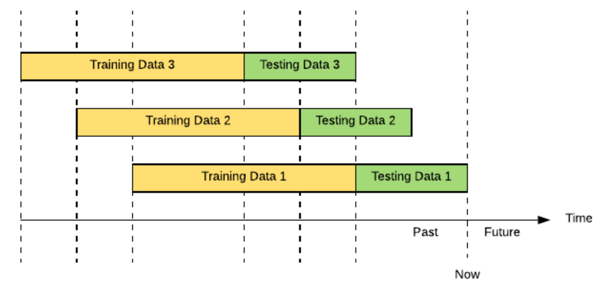
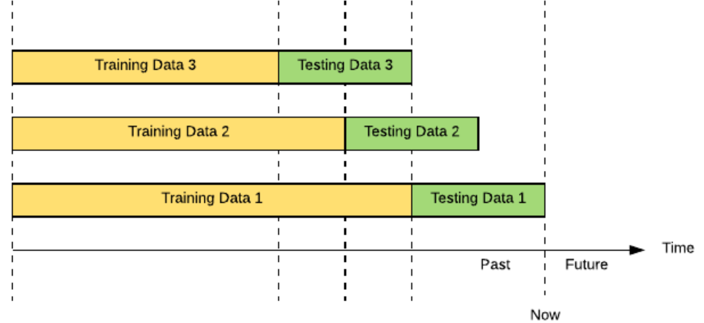

```{r setup, include=FALSE}
knitr::opts_chunk$set(echo = FALSE,warning = FALSE,
                      message = FALSE, options(scipen=999))
```

<style type="text/css">
  body{
  font-size: 12pt;
  }
  h1.title {
  font-size: 38px;
  color: DarkBlue;
  }
  h1 { /* Header 1 */
    font-size: 38px;
    color: DarkBlue;
  }
  h2 { /* Header 2 */
      font-size: 34px;
    color: DarkBlue;
  }
  h3 { /* Header 3 */
    font-size: 30px;
    <!-- font-family: "Times New Roman", Times, serif; -->
    color: DarkBlue;
  }
  code.r{ /* Code block */
      font-size: 12px;
  }
  pre { /* Code block - determines code spacing between lines */
      font-size: 12px;
  }
</style>

## Objetivo

O objetivo dessa apresentação é analisar o valor obtido de $\beta$, do modelo CAPM para 4 diferentes ativos usando 4 diferentes métodos para obtenção desse coeficientes.

Na análise realizada, foram comparados os $\beta s$ para diferentes ações utilizando os métodos descritos nos slides a seguir. Após o cálculo desses coeficientes foram feitas análises sobre os valores obtidos para cada ação. Essas análises foram:

- **Gráfica:** comparando os valores de $\beta$ para os métodos utilizados e também entre ações com o mesmo método
- **Erro Backtest:** comparando os valores de retorno estimados vs. os valores de retorno obtidos

## Capital Asset Pricing Model - CAPM ^1^ {.bigger}

CAPM é um modelo que calcula o retorno esperado de um ativo acima de um ativo "livre" de risco de mercado (geralmente um título público). Essa a taxa de retorno adicional é medido pelo coeficiente beta, de uma equação linear:

$\small R_{Asset} = R_{RiskFree} + \beta(R_{Mercado} - R_{RiskFree})$

No presente trabalho, serão realizadas diferentes metodologias para determinação do coeficiente $\beta$.

^1^ Definições adaptadas de: https://corporatefinanceinstitute.com/resources/knowledge/finance/what-is-capm-formula/

## Metodologia 1: Regressão Linear

O modelo se basea numa equação linear.

$y = b + ax$.

Nesse modelo o $\beta$ é um valor constante para toda a série de retornos.

Na análise feita aqui, não foi utilizado o excesso retorno ($(R_{Mercado} - R_{RiskFree})$) e sim o retorno de mercado $R_{Mercado}$.

A regressão linear é suficiente para poder definir o $\beta$.

Entretanto, fica a pergunta: esse $\beta$ é sempre igual ao longo do tempo?

Resposta: **Não**.

Portanto, serão apresentados a seguir outros métodos para definição desse coeficiente.

## Modelo Iterativo

O modelo iterativo é um modelo iterativo linear. Este modelo repete o modelo linear diversas vezes com diferentes amostras de maneira a calcular o $\beta$ diferente em cada instante de tempo.

Existem 2 técnicas de uso desse modelo:

- **Rolling ou Sliding Window:** amostra móvel em ambas as extremidades, sempre com o mesmo número de elementos em cada amostra
- **Expanding Window:** amostra onde o ponto inicial é fixado e o ponto final é incrementado, sempre com um número acumulativo de dados na amostra

Essas duas técnicas serão melhor explicadas a seguir

## Rolling ou Sliding Window {.smaller}

A técnica de Rolling Window (também conhecida como Sliding Window) tem por princípio, realizar $n$ regressões para uma 'janela' móvel de $m$ observações. Esse modelo realiza um processo iterativo, onde em cada iteração, o $\beta$ é calculado com base em uma regressão linear que considera os $m$ dias anteriores. 

Neste caso, o primeiro $\beta$ é calculado inicialmente para o dia $\small m+1$, usando os dados dos $m$ dias anteriores. 

Na próxima iteração a 'janela' de $\small m$ dias é deslocada em 1 dia e um novo $\beta$ é calculado para o dia seguinte ($\small m+2$).

Esse processo é repetido até que a amostra dos últimos $\small m$ dias seja utilizada.

Desta forma, são estimados os $\beta s$ que 'variam ao longo do tempo', sempre com amostras distintas entre si.

##### Rolling Window Example ^2^

```{r fig.align = 'center'}


```
<!--  -->

## Expanding Window {.smaller}

A técnica de Expanding Windows é parecida com a técnica de Rolling Window com uma pequena diferença. Essa técnica também é baseada em um modelo linear que é repetido iterativamente com uma nova amostra dos dados, entretanto, nesta técnica, o tamanho da amostra não é fixo. 
Diferente da técnica anterior, a janela de amostra é aumentada a cada nova iteração, conforme apresentado abaixo:

Na primeira iteração, a amostra da técnica de Expanding Window é identica a primeira amostra da técnica Rolling Window, ou seja, o valor de $\beta$ para o dia $\small m+1$ é calculado sobre uma amostra de $\small m$ dias.

Na seguinte iteração, o $\beta$ é agora calculado sobre um amostra de $\small m+1$ dias, onde o início da amostra permanece inalterado (dia 1 da série) e o fim da amostra ocorre 1 dia após.

Seguindo a mesma lógica, são feitas então as demais iterações, onde a cada nova iteração a amostra é aumentada em 1 dia (inicio no 1^o^ dia e término no dia anterior ao dia de interesse).

Um fato relevante é que na última amostra, todos os dados da série são usados e portanto esse último $\beta$ é igual ao $\beta$ do Modelo Linear Estático. Sendo assim, ao plotar um gráfico de $\small dias$ vs. $\beta$ + linha $\beta_{estático}$, ver-se-á um gráfico onde o $\beta$ tende a se aproximar cada vez mais do valor estático ao final da série.

##### Expanding Window Example [^2^]

```{r fig.align = 'center'}
# print("Expanding Window Example")

```


<!-- {width=50%} -->

^2^ Imagens retiradas de: https://eng.uber.com/backtesting-at-scale/
Colocar ações de antes de 2007

## Betas Variantes no tempo (Time-Varying Betas) {.smaller}

### Tsay - An Intr Analysis of Financial Data With R - 5.3.1

O modelo de Time-Varying Betas do livro Tsay, considera o $\beta$ como um coeficiente variante no tempo. 
Nesse caso, é feita também uma aproximação em que não é considerada como variável independente o excesso retorno $\small R_{Asset} - R_{RiskFree}$, mas sim o $\small R_{Asset}$.
Sendo assim a equação de CAPM é simplificada para $\small R_{Mercado} = R_{RiskFree} + \beta R_{Asset}$.

Esse coeficiente é calculado com base na correlação entre os valores de $\small R_{Asset}$ e $\small R_{RiskFree}$ ao longo do tempo.

Para esse cálculo, é utilizado o princípio estatítico:

$\small Var(x_t + y_t) = Var(x_t) + 2Cov(x_t , y_t) + Var(y_t)$
$\small Var(x_t - y_t) = Var(x_t) - 2Cov(x_t , y_t) + Var(y_t)$

Que permite isolar a covariância e calculá-la com base nas variâncias combinadas dos ativos:

$\small Cov(x_t , y_t) = {Var(x_t + y_t) − Var(x_t − y_t) \over 4}$

Dado que a volatilidade $\sigma_{x,t}$ é dada pela $\sqrt{var(x_t)}$ em um dado período, podemos então lançar mão de modelos GARCH para cálculo das variâncias ao longo do tempo e assim, calcular a Covariância. A determinação da ordem do GARCH é feita com testes de diferentes valores para m,n,modelo_GARCH(SGARCH e eGARCH),Distribuição_Erro (Normal e t-Student).

De posse do valores de Covariância, temos então que calcular a Correlação entre $x_t$ e $y_t$.

$\small Corr(x_t,y_t) = {Cov(x,y) \over \sqrt{Var(x)}\sqrt{Var(y)}} => Corr(x_t,y_t) = {Var(x_t + y_t) − Var(x_t − y_t) \over 4 \sqrt{Var(x)}\sqrt{Var(y)}}$

## DLM (Dynamic Linear Model)^3^

O modelo DLM considera que seus parâmetros variam no tempo. Esse modelo é um caso particular do Modelo de Espaço de Estados, que considera especificação linear e perturbações normais.

Para o modelo, considera-se a equação linear para modelos de espaço de estado, onde os estados atuais (Vetor $\theta_t$) dependem de uma combinação linear dos estados antecessores (Vetor $\theta_{t-1}$) acrescidos de um erro ($\omega_t$ - $N(0,W_t)$). A combinação linear dos estados é definida pela matriz ($G_t$). Desta forma, temos então a equação:

$\theta_t=G_t\theta_{t-1}+\omega_t$

Essa equação entretanto, utiliza os vetores de estado, que são diferentes dos valores observados, uma vez que esses últimos são compostos dos estados adicionados de um ruído. 
Faz-se necessário definir então a equação que descreve os espaços de estado em relação ao vetor de observações.
Essa definição é apresentada a seguir:

- $y_t=F^T_t\theta_t+\upsilon_t$

onde:

- $y_t$ - Vetor de Observações

- $F^T_t$ - Tranposta da Matriz combinação linear $F_t$

- $\upsilon_t$ - ruído $N(0,V_t)$

Para completar o modelo, é necessário definir um estado inicial ($\theta_0 \sim N(m_0,C_0)$) e as matrizes de Variância-Covariancia dos ruídos observado ($\upsilon_t \sim N(0,V_t)$) e estimado ($\omega_t \sim N(0,W_t)$)

Uma vez definido o modelo, é necessário agora um algoritmo para resolvê-lo. Neste caso, será utilizado o Algoritmo do Filtro de Kalman.

^3^ Definições adaptadas de: https://www.quantstart.com/articles/State-Space-Models-and-the-Kalman-Filter/

## Importando as cotações históricas

As análises usaram 4 papéis negociados na bolsa brasileira B3 em relação ao indíce IBOVESPA (100 principais ações da Bovespa). Os papéis são:

- Companhia Vale do Rio Doce - VALE3.SA
  - Companhia de Extração Mineral
- Petrobrás - PETR4.SA
  - Companhia de Exploração de Petróleo
- Via  Varejo - VVAR3.SA
  - Companhia do ramo de consumo varejista
- CEMIG - CMIG4.SA
  - Companhia do ramo de energia
- IBOVESPA - ^BVSP

```{r biblios}
source('funcoes_v2.R')

require(scales)
require(quantmod)
require(tidyverse)
require(ggplot2)
# require(Amelia)
# require(reshape2)
require(ggthemes) 
require(plyr)
# require(urca)
require(forecast)
require(tseries)
require("fGarch")
require("rugarch")
require(fDMA)
# library(doParallel)
library(xts)
# library(BETS)
# library(tibbletime)
library(dplyr)
library(kableExtra)
library(repr)
library(dlm)

```


```{r funcoes}
# Performance via Backtest
back_teste <- function(tvp_beta,ativo,mercado,nome){
  fitted = rep(NA, nrow(ativo))
  erro = rep(NA, nrow(ativo))
  
  for (t in 1:nrow(ativo)){
    fitted[t] = tvp_beta[t]*mercado[t]
    erro[t]   = ativo[t] - fitted[t]
  }
  
  MSE_beta_garch = mean(erro^2)
  MAE_beta_garch = mean(abs(erro))

  # MAE_rate <- MAE_beta_garch/MAE_est
  # 
  # MSE_rate <- MSE_beta_garch/MSE_est
  # 
  output <- matrix(c(MSE_beta_garch,MAE_beta_garch),2)

  rownames(output) <- c("MSE","MAE")

  colnames(output) <- nome
    
  return(output)
}
```


## Ações - Petrobrás

```{r importando_petr, cache=T}
# Importando as ações
petr <- importa_retorno('PETR4.SA')

# getSymbols('PETR4.SA')
# 
# petr2 <- na.locf(PETR4.SA$PETR4.SA.Adjusted)
# petr[[1]] %>% nrow()
# petr[[2]] %>% nrow()
# petr2 %>% nrow()

summary(petr[[1]])

# glimpse(petr[[1]])

par(mfrow = c(2,1))
plot(petr[[1]], main = 'Preço PETR4.SA')
plot(petr[[2]], main = 'Retorno PETR4.SA')
```


## Ações - Vale do Rio Doce

```{r importando_vale, cache=T}
vale <- importa_retorno('VALE3.SA')

summary(vale[[1]])

par(mfrow = c(2,1))
plot(vale[[1]], main = 'Preço VALE3.SA')
plot(vale[[2]], main = 'Retorno VALE3.SA')
```

## Ações - Via Varejo

```{r importando_via_var, cache=T}
vvar <- importa_retorno('VVAR3.SA')

summary(vvar[[1]])

par(mfrow = c(2,1))
plot(vvar[[1]], main = 'Preço VVAR3.SA')
plot(vvar[[2]], main = 'Retorno VVAR3.SA')

```


## Ações - CEMIG

```{r importando_cemig, cache=T}
cmig <- importa_retorno('CMIG4.SA')

summary(cmig[[1]])

par(mfrow = c(2,1))
plot(cmig[[1]], main = 'Preço CMIG4.SA')
plot(cmig[[2]], main = 'Retorno CMIG4.SA')

```

## Ações - Ibovespa

```{r importando_ibov, cache=T}
ibov <- importa_retorno('^BVSP')

summary(ibov[[1]])

par(mfrow = c(2,1))
plot(ibov[[1]], main = 'Pontos IBOVESPA')
plot(ibov[[2]], main = 'Retorno IBOVESPA')


```

## Calculando Beta Linear Estático - Petrobrás {.smaller}


```{r}
# fazendo com que todas as séries tenham as mesmas datas
# nrow(petr[[2]])
# nrow(vale[[2]])
# nrow(vvar[[2]])
# nrow(cmig[[2]])
# nrow(ibov[[2]])
# 
# nrow(petr_filtered)
# nrow(vale_filtered)
# nrow(vvar_filtered)
# nrow(cmig_filtered)
# nrow(ibov_filtered)

# petr_filtered <- datas_comuns_5(petr[[2]],vale[[2]],vvar[[2]],cmig[[2]],ibov[[2]])
# ibov_filtered <- datas_comuns_5(ibov[[2]],petr[[2]],vale[[2]],vvar[[2]],cmig[[2]])
# 
# vale_filtered <- datas_comuns_5(vale[[2]],petr[[2]],vvar[[2]],cmig[[2]],ibov[[2]])
# 
# vvar_filtered <- datas_comuns_5(vvar[[2]],vale[[2]],petr[[2]],cmig[[2]],ibov[[2]])
# 
# cmig_filtered <- datas_comuns_5(cmig[[2]],vvar[[2]],vale[[2]],petr[[2]],ibov[[2]])

petr_filtered <- petr[[2]]

ibov_filtered <- ibov[[2]]

vale_filtered <- vale[[2]]

vvar_filtered <- vvar[[2]]

cmig_filtered <- cmig[[2]]


```


```{r r_est_petr, results=FALSE}

# Filtrando somente pelas datas que existem nas duas séries
titulos <- c('PETROBRAS','IBOVESPA','Gráfico Aderência a Regressão')

papel1 <- petr[[2]]
papel2 <- ibov[[2]]

papel1_filtered <- datas_comuns(papel1,papel2)
papel2_filtered <- datas_comuns(papel2,papel1)
# selic_filtered <- datas_comuns(rf,papel2_filtered)

papel1_fit = lm(papel1_filtered ~ papel2_filtered)
summary(papel1_fit)
lm_petr <- papel1_fit

beta_petr <- papel1_fit$coefficients[2]

MSE_petr_estatico = mean((papel1_fit$fitted.values - papel1_filtered)^2)
MAE_petr_estatico = mean(abs(papel1_fit$fitted.values - papel1_filtered))

vet_back_test_est <- matrix()
x <- matrix(c(MSE_petr_estatico,MAE_petr_estatico))
colnames(x) <- 'PETR'
rownames(x) <- c('MSE','MAE')
vet_back_test_est <- x


par(mfrow=c(1,1))
plot(as.vector(papel2_filtered),as.vector(papel1_filtered),cex=0.8, col='darkblue',xlim = c(-0.15,0.1),ylim = c(-0.15,0.2),
     ylab=titulos[1], xlab = titulos[2],main=titulos[3])
abline(papel1_fit$coefficients, lwd=2)

```

O valor do $\beta_{est_{petr}}$ é `r beta_petr`.

MSE = `r MSE_petr_estatico`

MAE = `r MAE_petr_estatico`

## Calculando Beta Linear Estático - Vale {.smaller}

```{r r_est_vale, results=FALSE}

# Filtrando somente pelas datas que existem nas duas séries
titulos <- c('VALE','IBOVESPA','Gráfico Aderência a Regressão')

papel1 <- vale[[2]]
papel2 <- ibov[[2]]

papel1_filtered <- datas_comuns(papel1,papel2)
papel2_filtered <- datas_comuns(papel2,papel1)

papel1_fit = lm(papel1_filtered ~ papel2_filtered)
summary(papel1_fit)
lm_vale <- papel1_fit

beta_vale <- papel1_fit$coefficients[2]

MSE_vale_estatico = mean((papel1_fit$fitted.values - papel1_filtered)^2)
MAE_vale_estatico = mean(abs(papel1_fit$fitted.values - papel1_filtered))

x <- matrix(c(MSE_vale_estatico,MAE_vale_estatico))
colnames(x) <- 'VALE'
rownames(x) <- c('MSE','MAE')
vet_back_test_est <- vet_back_test_est %>% cbind(x)

par(mfrow=c(1,1))
plot(as.vector(papel2_filtered),as.vector(papel1_filtered),cex=0.8, col='darkblue',xlim = c(-0.15,0.1),ylim = c(-0.15,0.2),
     ylab=titulos[1], xlab = titulos[2],main=titulos[3])
abline(papel1_fit$coefficients, lwd=2)

```

O valor do $\beta_{est_{vale}}$ é `r beta_vale`.

MSE = `r MSE_vale_estatico`

MAE = `r MAE_vale_estatico`

## Calculando Beta Linear Estático - Via Varejo {.smaller}

```{r r_est_vvar, results=FALSE}

# Filtrando somente pelas datas que existem nas duas séries
titulos <- c('VIA VAREJO','IBOVESPA','Gráfico Aderência a Regressão')

papel1 <- vvar[[2]]
papel2 <- ibov[[2]]

papel1_filtered <- datas_comuns(papel1,papel2)
papel2_filtered <- datas_comuns(papel2,papel1)

papel1_fit = lm(papel1_filtered ~ papel2_filtered)
summary(papel1_fit)
lm_vvar <- papel1_fit

beta_vvar <- papel1_fit$coefficients[2]

MSE_vvar_estatico = mean((papel1_fit$fitted.values - papel1_filtered)^2)
MAE_vvar_estatico = mean(abs(papel1_fit$fitted.values - papel1_filtered))

x <- matrix(c(MSE_vvar_estatico,MAE_vvar_estatico))
colnames(x) <- 'VVAR'
rownames(x) <- c('MSE','MAE')
vet_back_test_est <- vet_back_test_est %>% cbind(x)

par(mfrow=c(1,1))
plot(as.vector(papel2_filtered),as.vector(papel1_filtered),cex=0.8, col='darkblue',xlim = c(-0.15,0.1),ylim = c(-0.15,0.2),
     ylab=titulos[1], xlab = titulos[2],main=titulos[3])
abline(papel1_fit$coefficients, lwd=2)

```

O valor do $\beta_{est_{vvar}}$ é `r beta_vvar`.

MSE = `r MSE_vvar_estatico`

MAE = `r MAE_vvar_estatico`


## Calculando Beta Linear Estático - Cemig {.smaller}

```{r r_est_cemig, results=FALSE}

# Filtrando somente pelas datas que existem nas duas séries
titulos <- c('CEMIG','IBOVESPA','Gráfico Aderência a Regressão')

papel1 <- cmig[[2]]
papel2 <- ibov[[2]]

papel1_filtered <- datas_comuns(papel1,papel2)
papel2_filtered <- datas_comuns(papel2,papel1)

papel1_fit = lm(papel1_filtered ~ papel2_filtered)
summary(papel1_fit)
lm_cmig <- papel1_fit

beta_cmig <- papel1_fit$coefficients[2]

MSE_cmig_estatico = mean((papel1_fit$fitted.values - papel1_filtered)^2)
MAE_cmig_estatico = mean(abs(papel1_fit$fitted.values - papel1_filtered))

x <- matrix(c(MSE_cmig_estatico,MAE_cmig_estatico))
colnames(x) <- 'CMIG'
rownames(x) <- c('MSE','MAE')
vet_back_test_est <- vet_back_test_est %>% cbind(x)

par(mfrow=c(1,1))
plot(as.vector(papel2_filtered),as.vector(papel1_filtered),cex=0.8, col='darkblue',xlim = c(-0.15,0.1),ylim = c(-0.15,0.2),
     ylab=titulos[1], xlab = titulos[2],main=titulos[3])
abline(papel1_fit$coefficients, lwd=2)

```

O valor do $\beta_{est_{cmig}}$ é `r beta_cmig`.

MSE = `r MSE_cmig_estatico`

MAE = `r MAE_cmig_estatico`

## Betas e erros Lineares Estáticos - Resumo

```{r resumo_betas}

betas <- tibble(Petrobras = round(beta_petr,3),
                Vale = round(beta_vale,3),
                Via_Varejo = round(beta_vvar,3),
                Cemig = round(beta_cmig,3))

betas <- betas %>% bind_rows(tibble(Petrobras = vet_back_test_est[,1]*100,
                                    Vale = vet_back_test_est[,2]*100,
                                    Via_Varejo = vet_back_test_est[,3]*100,
                                    Cemig = vet_back_test_est[,4]*100))

rownames(betas) <- c('Beta','MSEx100','MAEx100')
                                                                               
betas %>% round(3) %>% kbl() %>% kable_styling()

# vet_back_test_est %>% kbl() %>% kable_styling()

# DT::datatable(betas)

```

As ações da Petrobrás e Vale apresentaram $\beta s$ maiores que 1, o que denota um risco mais elevado que o do IBOVESPA, enquanto os $\beta s$ da Via Varejo e CEMIG, apresentam um risco menor que o IBOVESPA, dado que possuem valores menores que 1.


## Calculando Beta Linear Iterativo (Rolling Window)

```{r roling, cache=T}

init = round(nrow(ibov_filtered)/2, 0)
out = nrow(ibov_filtered) - init

betas_rol = tibble(Petr = NA, Vale = NA, VVar = NA, CMIG = NA)
for (t in 1:out){
  petr_fit2 = lm(petr_filtered[t:(init+t)] ~ ibov_filtered[t:(init+t)])
  vale_fit2 = lm(vale_filtered[t:(init+t)] ~ ibov_filtered[t:(init+t)])
  vvar_fit2 = lm(vvar_filtered[t:(init+t)] ~ ibov_filtered[t:(init+t)])
  cmig_fit2 = lm(cmig_filtered[t:(init+t)] ~ ibov_filtered[t:(init+t)])

  betas_rol = betas_rol %>% bind_rows(
                                      tibble(Petr = petr_fit2$coefficients[2] %>% round(digits = 3),
                                             Vale = vale_fit2$coefficients[2] %>% round(digits = 3),
                                             VVar = vvar_fit2$coefficients[2] %>% round(digits = 3),
                                             CMIG = cmig_fit2$coefficients[2] %>% round(digits = 3))
                                      )

}

betas_rol <- betas_rol %>% na.omit()

betas_rol_mat <- matrix(c(betas_rol$Petr,betas_rol$Vale,betas_rol$VVar,betas_rol$CMIG), ncol = 4)

plot.ts(betas_rol_mat, col=1:4, lwd=2, ylim=c(0,2), main='Rolling Betas',ylab = "Beta", plot.type = 'single')
abline(h=betas$Petrobras[1], col=1, lty=2)
abline(h=betas$Vale[1], col=2, lty=2)
abline(h=betas$Via_Varejo[1], col=3, lty=2)
abline(h=betas$Cemig[1], col=4, lty=2)
abline(h=1, col='gray', lty=1)
legend("bottom", col=1:4, lty=1,
       legend=c('Petrobrás','Vale','Via Varejo','CEMIG'),
       lwd = 2, cex=0.6, box.lty=2)


par(mfrow=c(2,2))
plot.ts(betas_rol_mat[,1], col=1, lwd=2, 
        ylim=c(min(betas_rol_mat[,1],betas$Petrobras)*0.9,
               max(betas_rol_mat[,1],betas$Petrobras)*1.1), 
        main='Petrobras',
        ylab = "Beta",
     xy.lines = F) 
abline(h=betas$Petrobras[1], col=2, lty=4, lwd = 3)
abline(h=1, col='gray', lty=1)


plot.ts(betas_rol_mat[,2], col=1, lwd=2, 
        ylim=c(min(betas_rol_mat[,2],betas$Vale)*0.9,
               max(betas_rol_mat[,2],betas$Vale)*1.1), 
        main='Vale',
        ylab = "Beta")
abline(h=betas$Vale[1], col='red', lty=2)
abline(h=1, col='gray', lty=1)


plot.ts(betas_rol_mat[,3], col=1, lwd=2,
        ylim=c(min(betas_rol_mat[,3],betas$Via_Varejo)*0.9,
               max(betas_rol_mat[,3],betas$Via_Varejo)*1.1), 
        main='Via Varejo',
        ylab = "Beta") 
abline(h=betas$Via_Varejo[1], col='red', lty=2)
abline(h=1, col='gray', lty=1)


plot.ts(betas_rol_mat[,4], col=1, lwd=2, 
        ylim=c(min(betas_rol_mat[,4],betas$Cemig)*0.9,
               max(betas_rol_mat[,4],betas$Cemig)*1.1), 
        main='Cemig',
        ylab = "Beta") 
abline(h=betas$Cemig[1], col='red', lty=2)
abline(h=1, col='gray', lty=1)

# Back Test Rolling - PETR,VALE,VVAR e CMIG
vet_back_test_rol <- matrix()
data_inic <- index(petr_filtered[init+1])
vet_back_test_rol <- back_teste(tvp_beta = betas_rol_mat[,1],
                                ativo = window(petr_filtered,start = data_inic),
                                mercado = window(ibov_filtered,start = data_inic),
                                nome = "PETR")

vet_back_test_rol <- vet_back_test_rol %>% cbind(back_teste(tvp_beta = betas_rol_mat[,2],
                                                            ativo = window(vale_filtered,start = data_inic),
                                                            mercado = window(ibov_filtered,start = data_inic),
                                                            nome = "VALE"))


vet_back_test_rol <- vet_back_test_rol %>% cbind(back_teste(tvp_beta = betas_rol_mat[,3],
                                                            ativo = window(vvar_filtered,start = data_inic),
                                                            mercado = window(ibov_filtered,start = data_inic),
                                                            nome = "VVAR"))

vet_back_test_rol <- vet_back_test_rol %>% cbind(back_teste(tvp_beta = betas_rol_mat[,4],
                                                            ativo = window(cmig_filtered,start = data_inic),
                                                            mercado = window(ibov_filtered,start = data_inic),
                                                            nome = "CMIG"))

```

## Comparação dos resultados (Rolling x Estático) {.smaller}

A tabela abaixo, apresenta a propoção do erro do Modelo Rolling Window em relação ao Modelo Estático. Para essa comparação foram usadas 2 métricas:

- MSE: Mean Square Error
- MAE: Mean Absolute Error

A proporção foi calculada dividindo o valor obtido no modelo Rolling dividido pelo valor obtido no modelo estático:

$MSE={MSE_{Rolling} \over MSE_{Estático}}$

$MAE={MAE_{Rolling} \over MAE_{Estático}}$

```{r roling_summary}
rol_est <- matrix(data = NA,nrow = 2,ncol = 4)
colnames(rol_est) <- c('PETR','VALE','VVAR','CMIG')
rownames(rol_est) <- c('MSE_ROL_EST','MAE_ROL_EST')

for (i in 1:4){
  for (j in 1:2){
    rol_est[j,i] <- round(vet_back_test_rol[j,i]/vet_back_test_est[j,i],3)
  }
}

rol_est %>% kbl() %>% kable_styling()

```


## Calculando Beta Linear Iterativo (Expanding Window)

```{r expanding, cache=T}
# init = round(nrow(ibov[[2]])/2, 0)
# out = nrow(ibov[[2]]) - init

# petr_filtered <- datas_comuns_5(petr[[2]],vale[[2]],vvar[[2]],cmig[[2]],ibov[[2]])
# ibov_filtered <- datas_comuns_5(ibov[[2]],petr[[2]],vale[[2]],vvar[[2]],cmig[[2]])
# 
# vale_filtered <- datas_comuns_5(vale[[2]],petr[[2]],vvar[[2]],cmig[[2]],ibov[[2]])
# 
# vvar_filtered <- datas_comuns_5(vvar[[2]],vale[[2]],petr[[2]],cmig[[2]],ibov[[2]])
# 
# cmig_filtered <- datas_comuns_5(cmig[[2]],vvar[[2]],vale[[2]],petr[[2]],ibov[[2]])

init = round(nrow(ibov_filtered)/2, 0)
out = nrow(ibov_filtered) - init

betas_exp = tibble(Petr = NA, Vale = NA, VVar = NA, CMIG = NA)
for (t in 1:out){
  petr_fit2 = lm(petr_filtered[1:(init+t)] ~ ibov_filtered[1:(init+t)])
  vale_fit2 = lm(vale_filtered[1:(init+t)] ~ ibov_filtered[1:(init+t)])
  vvar_fit2 = lm(vvar_filtered[1:(init+t)] ~ ibov_filtered[1:(init+t)])
  cmig_fit2 = lm(cmig_filtered[1:(init+t)] ~ ibov_filtered[1:(init+t)])

  betas_exp = betas_exp %>% bind_rows(
                                      tibble(Petr = petr_fit2$coefficients[2],
                                             Vale = vale_fit2$coefficients[2],
                                             VVar = vvar_fit2$coefficients[2],
                                             CMIG = cmig_fit2$coefficients[2])
                                      )

}

betas_exp <- betas_exp %>% na.omit()

betas_exp_mat <- matrix(c(betas_exp$Petr,betas_exp$Vale,betas_exp$VVar,betas_exp$CMIG), ncol = 4)


# betas_exp_mat <- xts(zoo(betas_exp_mat,as.Date(index(cmig_filtered))),order.by = as.Date(index(cmig_filtered)))

plot.ts(betas_exp_mat, col=1:4, lwd=2, ylim=c(0,2), main='Rolling Betas',ylab = "Beta",plot.type = "single")
abline(h=betas$Petrobras[1], col=1, lty=2)
abline(h=betas$Vale[1], col=2, lty=2)
abline(h=betas$Via_Varejo[1], col=3, lty=2)
abline(h=betas$Cemig[1], col=4, lty=2)
abline(h=1, col='gray', lty=1)
legend("bottom", col=1:4, lty=1,
       legend=c('Petrobrás','Vale','Via Varejo','CEMIG'),
       lwd = 2, cex=0.6, box.lty=2)

par(mfrow=c(2,2))
plot.ts(betas_exp_mat[,1], col=1, lwd=2, 
        ylim=c(min(betas_exp_mat[,1],betas$Petrobras)*0.9,
               max(betas_exp_mat[,1],betas$Petrobras)*1.1), 
        main='Petrobras',
        ylab = "Beta") 
abline(h=betas$Petrobras[1], col='red', lty=2)
abline(h=1, col='gray', lty=1)


plot.ts(betas_exp_mat[,2], col=1, lwd=2, 
        ylim=c(min(betas_exp_mat[,2],betas$Vale)*0.9,
               max(betas_exp_mat[,2],betas$Vale)*1.1), 
        main='Vale',
        ylab = "Beta")
abline(h=betas$Vale[1], col='red', lty=2)
abline(h=1, col='gray', lty=1)
# legend("bottom", col=1, lty=1,
#        legend=c('Vale'),
#        lwd = 2, cex=0.6, box.lty=2)

plot.ts(betas_exp_mat[,3], col=1, lwd=2,
        ylim=c(min(betas_exp_mat[,3],betas$Via_Varejo)*0.9,
               max(betas_exp_mat[,3],betas$Via_Varejo)*1.1), 
        main='Via Varejo',
        ylab = "Beta") 
abline(h=betas$Via_Varejo[1], col='red', lty=2)
abline(h=1, col='gray', lty=1)
# legend("bottom", col=1, lty=1,
#        legend=c('Via Varejo'),
#        lwd = 2, cex=0.6, box.lty=2)

plot.ts(betas_exp_mat[,4], col=1, lwd=2, 
        ylim=c(min(betas_exp_mat[,4],betas$Cemig)*0.9,
               max(betas_exp_mat[,4],betas$Cemig)*1.1), 
        main='Cemig',
        ylab = "Beta") 
abline(h=betas$Cemig[1], col='red', lty=2)
abline(h=1, col='gray', lty=1)


# Back Test Expanding - PETR,VALE,VVAR e CMIG
vet_back_test_exp <- matrix()
data_inic <- index(petr_filtered[init+1])
vet_back_test_exp <- back_teste(tvp_beta = betas_exp_mat[,1],
                                ativo = window(petr_filtered,start = data_inic),
                                mercado = window(ibov_filtered,start = data_inic),
                                nome = "PETR")


vet_back_test_exp <- vet_back_test_exp %>% cbind(back_teste(tvp_beta = betas_exp_mat[,2],
                                                            ativo = window(vale_filtered,start = data_inic),
                                                            mercado = window(ibov_filtered,start = data_inic),
                                                            nome = "VALE"))

vet_back_test_exp <- vet_back_test_exp %>% cbind(back_teste(tvp_beta = betas_exp_mat[,3],
                                                            ativo = window(vvar_filtered,start = data_inic),
                                                            mercado = window(ibov_filtered,start = data_inic),
                                                            nome = "VVAR"))

vet_back_test_exp <- vet_back_test_exp %>% cbind(back_teste(tvp_beta = betas_exp_mat[,4],
                                                            ativo = window(cmig_filtered,start = data_inic),
                                                            mercado = window(ibov_filtered,start = data_inic),
                                                            nome = "CMIG"))

```


## Comparação dos resultados (Expanding x Estático) {.smaller}

A tabela abaixo, apresenta a propoção do erro do Modelo Expanding Window em relação ao Modelo Estático. Para essa comparação foram usadas 2 métricas:

- MSE: Mean Square Error
- MAE: Mean Absolute Error

A proporção foi calculada dividindo o valor obtido no modelo Expanding dividido pelo valor obtido no modelo estático

$MSE={MSE_{Expanding} \over MSE_{Estático}}$

$MAE={MAE_{Expanding} \over MAE_{Estático}}$

```{r expanding_summary}
exp_est <- matrix(data = NA,nrow = 2,ncol = 4)
colnames(exp_est) <- c('PETR','VALE','VVAR','CMIG')
rownames(exp_est) <- c('MSE_EXP_EST','MAE_EXP_EST')

for (i in 1:4){
  for (j in 1:2){
    exp_est[j,i] <- round(vet_back_test_exp[j,i]/vet_back_test_est[j,i],3)
  }
}

exp_est %>% kbl() %>% kable_styling()

```


## Timing Varying Betas (TVB) - CAPM com modelo de volatilidade

```{r CAPM, cache=TRUE}
# Buscando efeito ARMA
arima_vet <- tibble(acao = NA, p=NA, q = NA)

arima_petr_mais <- auto.arima(petr_filtered+ibov_filtered, trace = F, ic="aic",stepwise = FALSE)
arima_vale_mais <- auto.arima(vale_filtered+ibov_filtered, trace = F, ic="aic",stepwise = FALSE)
arima_vvar_mais <- auto.arima(vvar_filtered+ibov_filtered, trace = F, ic="aic",stepwise = FALSE)
arima_cmig_mais <- auto.arima(cmig_filtered+ibov_filtered, trace = F, ic="aic",stepwise = FALSE)
arima_ibov <- auto.arima(ibov_filtered, trace = F, ic="aic",stepwise = FALSE)

arima_petr_menos <- auto.arima(petr_filtered-ibov_filtered, trace = F, ic="aic",stepwise = FALSE)
arima_vale_menos <- auto.arima(vale_filtered-ibov_filtered, trace = F, ic="aic",stepwise = FALSE)
arima_vvar_menos <- auto.arima(vvar_filtered-ibov_filtered, trace = F, ic="aic",stepwise = FALSE)
arima_cmig_menos <- auto.arima(cmig_filtered-ibov_filtered, trace = F, ic="aic",stepwise = FALSE)
# arima_ibov <- auto.arima(ibov_filtered-ibov_filtered, trace = F, ic="aic",stepwise = FALSE)

# Vetor de coeficientes ARMA
arima_vet <- arima_vet %>% bind_rows(tibble(acao = 'PETR+', p = arima_petr_mais$arma[1],q = arima_petr_mais$arma[2]))
arima_vet <- arima_vet %>% bind_rows(tibble(acao = 'VALE+', p = arima_vale_mais$arma[1],q = arima_vale_mais$arma[2]))
arima_vet <- arima_vet %>% bind_rows(tibble(acao = 'VVAR+', p = arima_vvar_mais$arma[1],q = arima_vvar_mais$arma[2]))
arima_vet <- arima_vet %>% bind_rows(tibble(acao = 'CMIG+', p = arima_cmig_mais$arma[1],q = arima_cmig_mais$arma[2]))
arima_vet <- arima_vet %>% bind_rows(tibble(acao = 'IBOV', p = arima_ibov$arma[1],q = arima_ibov$arma[2]))

arima_vet <- arima_vet %>% bind_rows(tibble(acao = 'PETR-', p = arima_petr_menos$arma[1],q = arima_petr_menos$arma[2]))
arima_vet <- arima_vet %>% bind_rows(tibble(acao = 'VALE-', p = arima_vale_menos$arma[1],q = arima_vale_menos$arma[2]))
arima_vet <- arima_vet %>% bind_rows(tibble(acao = 'VVAR-', p = arima_vvar_menos$arma[1],q = arima_vvar_menos$arma[2]))
arima_vet <- arima_vet %>% bind_rows(tibble(acao = 'CMIG-', p = arima_cmig_menos$arma[1],q = arima_cmig_menos$arma[2]))


arima_vet <- arima_vet %>% na.omit()

# arima_vet$p <- rep(0, 9)
# arima_vet$q <- rep(0, 9)

fit_petr_mais = list()
fit_vale_mais = list()
fit_vvar_mais = list()
fit_cmig_mais = list()
fit_ibov = list()
fit_petr_menos = list()
fit_vale_menos = list()
fit_vvar_menos = list()
fit_cmig_menos = list()

specs_petr_mais = list()
specs_vale_mais = list()
specs_vvar_mais = list()
specs_cmig_mais = list()
specs_ibov = list()
specs_petr_menos = list()
specs_vale_menos = list()
specs_vvar_menos = list()
specs_cmig_menos = list()

n <- 16

BICs_petr_mais = matrix(NA, n, 5)
colnames(BICs_petr_mais) = c('Arch-Order', 'Garch-Order','Model', 'Distr.', 'BIC')
rownames(BICs_petr_mais) = paste("Modelo", 1:n, sep = " ")

BICs_vale_mais = matrix(NA, n, 5)
colnames(BICs_vale_mais) = c('Arch-Order', 'Garch-Order','Model', 'Distr.', 'BIC')
rownames(BICs_vale_mais) = paste("Modelo", 1:n, sep = " ")

BICs_vvar_mais = matrix(NA, n, 5)
colnames(BICs_vvar_mais) = c('Arch-Order', 'Garch-Order','Model', 'Distr.', 'BIC')
rownames(BICs_vvar_mais) = paste("Modelo", 1:n, sep = " ")

BICs_cmig_mais = matrix(NA, n, 5)
colnames(BICs_cmig_mais) = c('Arch-Order', 'Garch-Order','Model', 'Distr.', 'BIC')
rownames(BICs_cmig_mais) = paste("Modelo", 1:n, sep = " ")

BICs_ibov = matrix(NA, n, 5)
colnames(BICs_ibov) = c('Arch-Order', 'Garch-Order','Model', 'Distr.', 'BIC')
rownames(BICs_ibov) = paste("Modelo", 1:n, sep = " ")

BICs_petr_menos = matrix(NA, n, 5)
colnames(BICs_petr_menos) = c('Arch-Order', 'Garch-Order','Model', 'Distr.', 'BIC')
rownames(BICs_petr_menos) = paste("Modelo", 1:n, sep = " ")

BICs_vale_menos = matrix(NA, n, 5)
colnames(BICs_vale_menos) = c('Arch-Order', 'Garch-Order','Model', 'Distr.', 'BIC')
rownames(BICs_vale_menos) = paste("Modelo", 1:n, sep = " ")

BICs_vvar_menos = matrix(NA, n, 5)
colnames(BICs_vvar_menos) = c('Arch-Order', 'Garch-Order','Model', 'Distr.', 'BIC')
rownames(BICs_vvar_menos) = paste("Modelo", 1:n, sep = " ")

BICs_cmig_menos = matrix(NA, n, 5)
colnames(BICs_cmig_menos) = c('Arch-Order', 'Garch-Order','Model', 'Distr.', 'BIC')
rownames(BICs_cmig_menos) = paste("Modelo", 1:n, sep = " ")

# BICs_ibov = matrix(NA, 16, 5)
# colnames(BICs_ibov) = c('Arch-Order', 'Garch-Order','Model', 'Distr.', 'BIC')
# rownames(BICs_ibov) = paste("Modelo", 1:16, sep = " ")

        # specs_petr = ugarchspec(mean.model = list(armaOrder = c(0,0)),
        #                         variance.model = list(garchOrder=c(1,1)))
        # 
        # fit_petr = ugarchfit(specs_petr, data = petr_filtered, solver = 'hybrid')
        # 
        # infocriteria(fit_petr)[2]
        # 
        # x[2]

dist = c('norm', 'std')
model = c('sGARCH', 'eGARCH')

k = 1

max_ordem <- 2
# Iteração para buscar o  melhor modelo GARCH para cada ativo
for (i in 1:max_ordem){
  for (j in 1:max_ordem){
    for (l in 1:length(dist)){
      for (m in 1:length(model)){
        # print(c(i,j,l,m))
        specs_petr_mais[[k]] = ugarchspec(mean.model = list(armaOrder = c(arima_vet[arima_vet$acao == 'PETR+',]$p,
                                                                     arima_vet[arima_vet$acao == 'PETR+',]$q)),
                                variance.model = list(model=model[m], garchOrder=c(i,j)),
                                distribution.model = dist[l])
        specs_vale_mais[[k]] = ugarchspec(mean.model = list(armaOrder = c(arima_vet[arima_vet$acao == 'VALE+',]$p,
                                                                     arima_vet[arima_vet$acao == 'VALE+',]$q)),
                                variance.model = list(model=model[m], garchOrder=c(i,j)),
                                distribution.model = dist[l])
        specs_vvar_mais[[k]] = ugarchspec(mean.model = list(armaOrder = c(arima_vet[arima_vet$acao == 'VVAR+',]$p,
                                                                     arima_vet[arima_vet$acao == 'VVAR+',]$q)),
                                variance.model = list(model=model[m], garchOrder=c(i,j)),
                                distribution.model = dist[l])
        specs_cmig_mais[[k]] = ugarchspec(mean.model = list(armaOrder = c(arima_vet[arima_vet$acao == 'CMIG+',]$p,
                                                                     arima_vet[arima_vet$acao == 'CMIG+',]$q)),
                                variance.model = list(model=model[m], garchOrder=c(i,j)),
                                distribution.model = dist[l])
        
        specs_ibov[[k]] = ugarchspec(mean.model = list(armaOrder = c(arima_vet[arima_vet$acao == 'IBOV',]$p,
                                                                     arima_vet[arima_vet$acao == 'IBOV',]$q)),
                                variance.model = list(model=model[m], garchOrder=c(i,j)),
                                distribution.model = dist[l])
        
        
        specs_petr_menos[[k]] = ugarchspec(mean.model = list(armaOrder = c(arima_vet[arima_vet$acao == 'PETR-',]$p,
                                                                     arima_vet[arima_vet$acao == 'PETR-',]$q)),
                                variance.model = list(model=model[m], garchOrder=c(i,j)),
                                distribution.model = dist[l])
        specs_vale_menos[[k]] = ugarchspec(mean.model = list(armaOrder = c(arima_vet[arima_vet$acao == 'VALE-',]$p,
                                                                     arima_vet[arima_vet$acao == 'VALE-',]$q)),
                                variance.model = list(model=model[m], garchOrder=c(i,j)),
                                distribution.model = dist[l])
        specs_vvar_menos[[k]] = ugarchspec(mean.model = list(armaOrder = c(arima_vet[arima_vet$acao == 'VVAR-',]$p,
                                                                     arima_vet[arima_vet$acao == 'VVAR-',]$q)),
                                variance.model = list(model=model[m], garchOrder=c(i,j)),
                                distribution.model = dist[l])
        specs_cmig_menos[[k]] = ugarchspec(mean.model = list(armaOrder = c(arima_vet[arima_vet$acao == 'CMIG-',]$p,
                                                                     arima_vet[arima_vet$acao == 'CMIG-',]$q)),
                                variance.model = list(model=model[m], garchOrder=c(i,j)),
                                distribution.model = dist[l])

        fit_petr_mais[[k]] = ugarchfit(specs_petr_mais[[k]], data = petr_filtered+ibov_filtered)

        fit_vale_mais[[k]] = ugarchfit(specs_vale_mais[[k]], data = vale_filtered+ibov_filtered)

        fit_vvar_mais[[k]] = ugarchfit(specs_vvar_mais[[k]], data = vvar_filtered+ibov_filtered)

        fit_cmig_mais[[k]] = ugarchfit(specs_cmig_mais[[k]], data = cmig_filtered+ibov_filtered)
        
        fit_ibov[[k]] = ugarchfit(specs_ibov[[k]], data = ibov_filtered)
        
        fit_petr_menos[[k]] = ugarchfit(specs_petr_menos[[k]], data = petr_filtered-ibov_filtered)

        fit_vale_menos[[k]] = ugarchfit(specs_vale_menos[[k]], data = vale_filtered-ibov_filtered)

        fit_vvar_menos[[k]] = ugarchfit(specs_vvar_menos[[k]], data = vvar_filtered-ibov_filtered)

        fit_cmig_menos[[k]] = ugarchfit(specs_cmig_menos[[k]], data = cmig_filtered-ibov_filtered)

        
        # Força SGARCH (1,1) NORMAL
        # BICs_petr_mais[k,] = c(1,1, "sGARCH", "norm",  abs(round(infocriteria(fit_petr_mais[[k]])[2],3)))
        # BICs_vale_mais[k,] = c(1,1, "sGARCH", "norm",  abs(round(infocriteria(fit_vale_mais[[k]])[2],3)))
        # BICs_vvar_mais[k,] = c(1,1, "sGARCH", "norm",  abs(round(infocriteria(fit_vvar_mais[[k]])[2],3)))
        # BICs_cmig_mais[k,] = c(1,1, "sGARCH", "norm",  abs(round(infocriteria(fit_cmig_mais[[k]])[2],3)))
        # BICs_ibov[k,] = c(1,1, "sGARCH", "norm",  abs(round(infocriteria(fit_ibov[[k]])[2],3)))
        # 
        # BICs_petr_menos[k,] = c(1,1, "sGARCH", "norm",  abs(round(infocriteria(fit_petr_menos[[k]])[2],3)))
        # BICs_vale_menos[k,] = c(1,1, "sGARCH", "norm",  abs(round(infocriteria(fit_vale_menos[[k]])[2],3)))
        # BICs_vvar_menos[k,] = c(1,1, "sGARCH", "norm",  abs(round(infocriteria(fit_vvar_menos[[k]])[2],3)))
        # BICs_cmig_menos[k,] = c(1,1, "sGARCH", "norm",  abs(round(infocriteria(fit_cmig_menos[[k]])[2],3)))
        
        # Guardando os dados dos modelos 'fittado'
        BICs_petr_mais[k,] = c(i,j, model[m], dist[l],  round(infocriteria(fit_petr_mais[[k]])[2],4))
        BICs_vale_mais[k,] = c(i,j, model[m], dist[l],  round(infocriteria(fit_vale_mais[[k]])[2],4))
        BICs_vvar_mais[k,] = c(i,j, model[m], dist[l],  round(infocriteria(fit_vvar_mais[[k]])[2],4))
        BICs_cmig_mais[k,] = c(i,j, model[m], dist[l],  round(infocriteria(fit_cmig_mais[[k]])[2],4))
        BICs_ibov[k,] = c(i,j, model[m], dist[l],  round(infocriteria(fit_ibov[[k]])[2],4))

        BICs_petr_menos[k,] = c(i,j, model[m], dist[l],  round(infocriteria(fit_petr_menos[[k]])[2],4))
        BICs_vale_menos[k,] = c(i,j, model[m], dist[l],  round(infocriteria(fit_vale_menos[[k]])[2],4))
        BICs_vvar_menos[k,] = c(i,j, model[m], dist[l],  round(infocriteria(fit_vvar_menos[[k]])[2],4))
        BICs_cmig_menos[k,] = c(i,j, model[m], dist[l],  round(infocriteria(fit_cmig_menos[[k]])[2],4))

        k = k + 1

      }
    }
  }
}

# Encontrando o melhor modelo
row_end <- length(dist)*length(model)*max_ordem*max_ordem
best_petr_mais <- which(BICs_petr_mais[,5] == min(BICs_petr_mais[(1:row_end),5]), arr.ind = TRUE)
best_vale_mais <- which(BICs_vale_mais[,5] == min(BICs_vale_mais[(1:row_end),5]), arr.ind = TRUE)
best_vvar_mais <- which(BICs_vvar_mais[,5] == min(BICs_vvar_mais[(1:row_end),5]), arr.ind = TRUE)
best_cmig_mais <- which(BICs_cmig_mais[,5] == min(BICs_cmig_mais[(1:row_end),5]), arr.ind = TRUE)
best_ibov <- which(BICs_ibov[,5] == min(BICs_ibov[(1:row_end),5]), arr.ind = TRUE)

best_petr_menos <- which(BICs_petr_menos[,5] == min(BICs_petr_menos[(1:row_end),5]), arr.ind = TRUE)
best_vale_menos <- which(BICs_vale_menos[,5] == min(BICs_vale_menos[(1:row_end),5]), arr.ind = TRUE)
best_vvar_menos <- which(BICs_vvar_menos[,5] == min(BICs_vvar_menos[(1:row_end),5]), arr.ind = TRUE)
best_cmig_menos <- which(BICs_cmig_menos[,5] == min(BICs_cmig_menos[(1:row_end),5]), arr.ind = TRUE)
```


```{r CAPM2, fig.width = 12,fig.height = 7}
# BICs_petr[best_petr,]
# BICs_vale_mais[best_vale_mais,]
# BICs_vale_menos[best_vale_menos,]
# BICs_vvar[best_vvar,]
# BICs_cmig[best_cmig,]
# BICs_cmig[best_ibov,]


# Criando as especificações com os parâmetros definidos como melhores
specs_petr_mais = ugarchspec(mean.model = list(armaOrder = c(arima_vet[arima_vet$acao == 'PETR+',]$p,
                                                        arima_vet[arima_vet$acao == 'PETR+',]$q)),
                                variance.model = list(model=BICs_petr_mais[best_petr_mais,3],
                                                      garchOrder=c(as.integer(BICs_petr_mais[best_petr_mais,1]),
                                                                   as.integer(BICs_petr_mais[best_petr_mais,2]))),
                                distribution.model = BICs_petr_mais[best_petr_mais,4])

specs_vale_mais = ugarchspec(mean.model = list(armaOrder = c(arima_vet[arima_vet$acao == 'VALE+',]$p,
                                                        arima_vet[arima_vet$acao == 'VALE+',]$q)),
                                variance.model = list(model=BICs_vale_mais[best_vale_mais,3],
                                                      garchOrder=c(as.integer(BICs_vale_mais[best_vale_mais,1]),
                                                                   as.integer(BICs_vale_mais[best_vale_mais,2]))),
                                distribution.model = BICs_vale_mais[best_vale_mais,4])

specs_vvar_mais = ugarchspec(mean.model = list(armaOrder = c(arima_vet[arima_vet$acao == 'VVAR+',]$p,
                                                        arima_vet[arima_vet$acao == 'VVAR+',]$q)),
                                variance.model = list(model=BICs_vvar_mais[best_vvar_mais,3],
                                                      garchOrder=c(as.integer(BICs_vvar_mais[best_vvar_mais,1]),
                                                                   as.integer(BICs_vvar_mais[best_vvar_mais,2]))),
                                distribution.model = BICs_vvar_mais[best_vvar_mais,4])

specs_cmig_mais = ugarchspec(mean.model = list(armaOrder = c(arima_vet[arima_vet$acao == 'CMIG+',]$p,
                                                        arima_vet[arima_vet$acao == 'CMIG+',]$q)),
                                variance.model = list(model=BICs_cmig_mais[best_cmig_mais,3],
                                                      garchOrder=c(as.integer(BICs_cmig_mais[best_cmig_mais,1]),
                                                                   as.integer(BICs_cmig_mais[best_cmig_mais,2]))),
                                distribution.model = BICs_cmig_mais[best_cmig_mais,4])

specs_ibov = ugarchspec(mean.model = list(armaOrder = c(arima_vet[arima_vet$acao == 'IBOV',]$p,
                                                        arima_vet[arima_vet$acao == 'IBOV',]$q)),
                                variance.model = list(model=BICs_ibov[best_ibov,3],
                                                      garchOrder=c(as.integer(BICs_ibov[best_ibov,1]),
                                                                   as.integer(BICs_ibov[best_ibov,2]))),
                                distribution.model = BICs_ibov[best_ibov,4])


specs_petr_menos = ugarchspec(mean.model = list(armaOrder = c(arima_vet[arima_vet$acao == 'PETR-',]$p,
                                                        arima_vet[arima_vet$acao == 'PETR-',]$q)),
                                variance.model = list(model=BICs_petr_menos[best_petr_menos,3],
                                                      garchOrder=c(as.integer(BICs_petr_menos[best_petr_menos,1]),
                                                                   as.integer(BICs_petr_menos[best_petr_menos,2]))),
                                distribution.model = BICs_petr_menos[best_petr_menos,4])

specs_vale_menos = ugarchspec(mean.model = list(armaOrder = c(arima_vet[arima_vet$acao == 'VALE-',]$p,
                                                        arima_vet[arima_vet$acao == 'VALE-',]$q)),
                                variance.model = list(model=BICs_vale_menos[best_vale_menos,3],
                                                      garchOrder=c(as.integer(BICs_vale_menos[best_vale_menos,1]),
                                                                   as.integer(BICs_vale_menos[best_vale_menos,2]))),
                                distribution.model = BICs_vale_menos[best_vale_menos,4])

specs_vvar_menos = ugarchspec(mean.model = list(armaOrder = c(arima_vet[arima_vet$acao == 'VVAR-',]$p,
                                                        arima_vet[arima_vet$acao == 'VVAR-',]$q)),
                                variance.model = list(model=BICs_vvar_menos[best_vvar_menos,3],
                                                      garchOrder=c(as.integer(BICs_vvar_menos[best_vvar_menos,1]),
                                                                   as.integer(BICs_vvar_menos[best_vvar_menos,2]))),
                                distribution.model = BICs_vvar_menos[best_vvar_menos,4])

specs_cmig_menos = ugarchspec(mean.model = list(armaOrder = c(arima_vet[arima_vet$acao == 'CMIG-',]$p,
                                                        arima_vet[arima_vet$acao == 'CMIG-',]$q)),
                                variance.model = list(model=BICs_cmig_menos[best_cmig_menos,3],
                                                      garchOrder=c(as.integer(BICs_cmig_menos[best_cmig_menos,1]),
                                                                   as.integer(BICs_cmig_menos[best_cmig_menos,2]))),
                                distribution.model = BICs_cmig_menos[best_cmig_menos,4])

# Fit do modelo de Mercado - IBOV
fit_ibov <- ugarchfit(specs_ibov, data = ibov_filtered, solver = 'hybrid')

# Fit dos ativos + retorno de mercado
fit_petr_mais = ugarchfit(specs_petr_mais, data = petr_filtered+ibov_filtered, solver = 'hybrid')

fit_vale_mais = ugarchfit(specs_vale_mais, data = vale_filtered+ibov_filtered, solver = 'hybrid')

fit_vvar_mais = ugarchfit(specs_vvar_mais, data = vvar_filtered+ibov_filtered, solver = 'hybrid')

fit_cmig_mais = ugarchfit(specs_cmig_mais, data = cmig_filtered+ibov_filtered, solver = 'hybrid')


# Fit dos ativos - retorno de mercado
fit_petr_menos = ugarchfit(specs_petr_menos, data = petr_filtered-ibov_filtered, solver = 'hybrid')

fit_vale_menos = ugarchfit(specs_vale_menos, data = vale_filtered-ibov_filtered, solver = 'hybrid')

fit_vvar_menos = ugarchfit(specs_vvar_menos, data = vvar_filtered-ibov_filtered, solver = 'hybrid')
fit_cmig_menos = ugarchfit(specs_cmig_menos, data = cmig_filtered-ibov_filtered, solver = 'hybrid')


# coletando as variâncias dos retornos somados e subtraidos
petr_mais <- fit_petr_mais@fit$sigma^2
petr_menos <- fit_petr_menos@fit$sigma^2

vale_mais <- fit_vale_mais@fit$sigma^2
vale_menos <- fit_vale_menos@fit$sigma^2

vvar_mais <- fit_vvar_mais@fit$sigma^2
vvar_menos <- fit_vvar_menos@fit$sigma^2

cmig_mais <- fit_cmig_mais@fit$sigma^2
cmig_menos <- fit_cmig_menos@fit$sigma^2

# Coletando a variância do Mercado
var_ibov = fit_ibov@fit$sigma^2

# Montando os vetores dos betas
tvp_beta_petr = (petr_mais - petr_menos)/(4*var_ibov)
tvp_beta_vale = (vale_mais - vale_menos)/(4*var_ibov)
tvp_beta_vvar = (vvar_mais - vvar_menos)/(4*var_ibov)
tvp_beta_cmig = (cmig_mais - cmig_menos)/(4*var_ibov)

par(mfrow=c(2,2))
# options(repr.plot.width = 30, repr.plot.height = 18)
# par("fin") (30, 20)
ts.plot(tvp_beta_petr, col=1, ylab='Beta', main='Time-Varying Beta - Petrobrás', lwd=1)
abline(h=betas$Petrobras[1], lty=2, lwd=2, col=1)

ts.plot(tvp_beta_vale, col=2, ylab='Beta', main='Time-Varying Beta - Vale', lwd=1)
abline(h=betas$Vale[1], lty=2, lwd=2, col=2)

ts.plot(tvp_beta_vvar, col=3, ylab='Beta', main='Time-Varying Beta - Via Varejo', lwd=1, ylim = c(-5,5))
abline(h=betas$Via_Varejo[1], lty=2, lwd=2, col=3)

ts.plot(tvp_beta_cmig, col=4, ylab='Beta', main='Time-Varying Beta - CEMIG', lwd=1)
abline(h=betas$Cemig[1], lty=2, lwd=2, col=4)


# tvp_beta <- tvp_beta_vale
# ativo <- vale_filtered
# mercado <- ibov_filtered
# MSE_est <- MSE_vale_estatico
# MAE_est <- MAE_vale_estatico
# nome <- "VALE"
# 
# fitted = rep(NA, nrow(ativo))
# erro = rep(NA, nrow(ativo))
# 
# for (t in 1:nrow(ativo)){
#   fitted[t] = tvp_beta[t]*mercado[t]
#   erro[t]   = ativo[t] - fitted[t]
# }
# 
# MSE_beta_garch = mean(erro^2)
# MAE_beta_garch = mean(abs(erro))
# 
# MAE_rate <- MAE_beta_garch/MAE_est
# 
# MSE_rate <- MSE_beta_garch/MSE_est
# 
# output <- matrix(c(MSE_rate,MAE_rate),2)
# 
# rownames(output) <- c("MSE","MAE")
# 
# colnames(output) <- nome
#   
# output


vet_back_test <- matrix()

vet_back_test <- back_teste(tvp_beta_petr,
                            petr_filtered,
                            ibov_filtered,
                            "PETR")

vet_back_test <- vet_back_test %>% cbind(back_teste(tvp_beta_vale,
                               vale_filtered,
                               ibov_filtered,
                               "VALE"))

vet_back_test <- vet_back_test %>% cbind(back_teste(tvp_beta_vvar,
                               vvar_filtered,
                               ibov_filtered,
                               "VVAR"))

vet_back_test <- vet_back_test %>% cbind(back_teste(tvp_beta_cmig,
                               cmig_filtered,
                               ibov_filtered,
                               "CMIG"))

# betas <- tibble(Petrobras = round(beta_petr,3),
#                 Vale = round(beta_vale,3),
#                 Via_Varejo = round(beta_vvar,3),
#                 Cemig = round(beta_cmig,3))
```


## Comparação dos resultados (TVB x Estático) {.smaller}

A tabela abaixo, apresenta a propoção do erro do Modelo TVB em relação ao Modelo Estático. Para essa comparação foram usadas 2 métricas:

- MSE: Mean Square Error
- MAE: Mean Absolute Error

A proporção foi calculada dividindo o valor obtido no modelo TVB dividido pelo valor obtido no modelo estático

$MSE={MSE_{TVB} \over MSE_{Estático}}$|                e                |$MAE={MAE_{TVB} \over MAE_{Estático}}$

```{r CAPM_Summary}
# DT::datatable(vet_back_test)

tvb_est <- matrix(data = NA,nrow = 2,ncol = 4)
colnames(tvb_est) <- c('PETR','VALE','VVAR','CMIG')
rownames(tvb_est) <- c('MSE_TVB_EST','MAE_TVB_EST')

for (i in 1:4){
  for (j in 1:2){
    tvb_est[j,i] <- round(vet_back_test[j,i]/vet_back_test_est[j,i],3)
  }
}

tvb_est %>% kbl() %>% kable_styling()

```
Ações que indicam mudança de risco da empresa ao longo do tempo:

- Petrobras: melhor desempenho do modelo Beta dinâmico em relação ao Beta estático

- Via Varejo: possui uma melhora no erro do backtest, mas bem menos significativo

Ações que o Beta varia com menos intensidade ao longo do tempo e o Beta estático produz resultado semelhante no longo prazo:

- Vale do Rio Doce

- Cemig


## DLM - Petrobrás

### Modelo Normal e Suavizado

```{r DLM_petr, cache=T, fig.width=12,fig.height=7}
buildCapm <- function(parametros) {
  
  dlmModReg(ibov_filtered, dV = exp(parametros[1]), dW = exp(parametros[2 : 3]))
  
}

acao <- petr_filtered

outMLE <- dlmMLE(acao, parm = rep(0, 3), buildCapm)

model <- buildCapm(parametros = outMLE$par)


model_filtered = dlmFilter(acao,model)

outS <- dlmSmooth(acao, model)
# Gráficos Normais
par(mfrow=c(2,2))
ts.plot(dropFirst(model_filtered$m[,1]), ylab='', main=expression(alpha[t]),lwd=2, col=2)
abline(h=lm_petr$coefficientes[1], lty=2)

ts.plot(dropFirst(model_filtered$m[,2]), ylab='',main=expression(beta[t]), lwd=2, col=4)
abline(h=lm_petr$coefficients[2], lty=2)

# Gráfico Suavizado
# par(mfrow=c(1,1))
ts.plot(dropFirst(outS$s[,1]), ylab='', main=expression(alpha[t]),lwd=2, col=2)
abline(h=lm_petr$coefficients[1], lty=2)
# abline(h=estatico$coefficients[1], lty=2)


ts.plot(dropFirst(outS$s[,2]), ylab='',main=expression(beta[t]), lwd=2, col=4)
abline(h=lm_petr$coefficients[2], lty=2)

```

```{r DLM_petr2, cache=T}


# Backtest
forecast = model_filtered$f

# MSE e MAE
mse_petr_kf = mean((forecast - petr_filtered)^2)
mae_petr_kf = mean(abs(forecast - petr_filtered))

vet_back_test_kf <- matrix()
x <- matrix(c(mse_petr_kf,mae_petr_kf))
colnames(x) <- 'PETR'
rownames(x) <- c('MSE','MAE')
vet_back_test_kf <- x

# MSE_final<- matrix(c(vet_back_test[1,1]/MSE_petr_estatico,
#                      mse_petr_kf/MSE_petr_estatico,
#                      mse_petr_kf/vet_back_test[1,1]))
# 
# rownames(MSE_final) <- c("TVB/EST","DLM/EST","DLM/TVB")
# 
# colnames(MSE_final) <- "PETR-MSE"
# 
# MAE_final<- matrix(c(vet_back_test[2,1]/MAE_petr_estatico,
#                      mae_petr_kf/MAE_petr_estatico,
#                      mae_petr_kf/vet_back_test[2,1]))
# 
# rownames(MAE_final) <- c("TVB/EST","DLM/EST","DLM/TVB")
# 
# colnames(MAE_final) <- "PETR-MAE"

# mse_petr_kf/MSE_petr_estatico

# mae_petr_kf/MAE_petr_estatico


```


## DLM - Vale

### Modelo Normal e Suavizado

```{r DLM_vale, cache=T,fig.width=12,fig.height=7}
acao <- vale_filtered

outMLE <- dlmMLE(acao, parm = rep(0, 3), buildCapm)


model <- buildCapm(outMLE$par)


model_filtered = dlmFilter(acao,model)

outS <- dlmSmooth(acao, model)
# Graficos Normais
par(mfrow=c(2,2))
ts.plot(dropFirst(model_filtered$m[,1]), ylab='', main=expression(alpha[t]),lwd=2, col=2)
abline(h=lm_vale$coefficients[1], lty=2)

ts.plot(dropFirst(model_filtered$m[,2]), ylab='',main=expression(beta[t]), lwd=2, col=4)
abline(h=lm_vale$coefficients[2], lty=2)

# Gráfico Suavizado
# par(mfrow=c(1,1))
ts.plot(dropFirst(outS$s[,1]), ylab='', main=expression(alpha[t]),lwd=2, col=2)
abline(h=lm_vale$coefficients[1], lty=2)

ts.plot(dropFirst(outS$s[,2]), ylab='',main=expression(beta[t]), lwd=2, col=4)
abline(h=lm_vale$coefficients[2], lty=2)
```


```{r DLM_vale2, cache=T}


# Backtest do CAPM 
forecast = model_filtered$f

# MSE e MAE
mse_vale_kf = mean((forecast - vale_filtered)^2)
mae_vale_kf = mean(abs(forecast - vale_filtered))

x <- matrix(c(mse_vale_kf,mae_vale_kf))
colnames(x) <- 'VALE'
rownames(x) <- c('MSE','MAE')
vet_back_test_kf <- vet_back_test_kf %>% cbind(x)

# # Calculando racionais dos erros em relação ao estático
# MSE_final<- MSE_final %>% cbind(c(vet_back_test[1,2]/MSE_vale_estatico,
#                            mse_vale_kf/MSE_vale_estatico,
#                            mse_vale_kf/vet_back_test[1,2]))
# 
# # rownames(MSE_final) <- c("TVB/EST","DLM/EST")
# 
# colnames(MSE_final) <- c("PETR-MSE", "VALE-MSE")
# 
# MAE_final <- MAE_final %>% cbind(c(vet_back_test[2,2]/MAE_vale_estatico,
#                      mae_vale_kf/MAE_vale_estatico,
#                      mae_vale_kf/vet_back_test[2,2]))
# 
# # rownames(MAE_final) <- c("TVB/EST","DLM/EST")
# 
# colnames(MAE_final) <- c("PETR-MAE", "VALE-MAE")


```

## DLM - Via Varejo

### Modelo Normal e Suavizado

```{r DLM_vvar, cache=T,fig.width=12,fig.height=7}
acao <- vvar_filtered

outMLE <- dlmMLE(acao, parm = rep(0, 3), buildCapm)


model <- buildCapm(outMLE$par)


model_filtered = dlmFilter(acao,model)


outS <- dlmSmooth(acao, model)

# Gráficos Normais
par(mfrow=c(2,2))
ts.plot(dropFirst(model_filtered$m[,1]), ylab='', main=expression(alpha[t]),lwd=2, col=2)
abline(h=lm_vvar$coefficients[1], lty=2)

ts.plot(dropFirst(model_filtered$m[,2]), ylab='',main=expression(beta[t]), lwd=2, col=4)
abline(h=lm_vvar$coefficients[2], lty=2)

# Graficos Suavizados
ts.plot(dropFirst(outS$s[,1]), ylab='', main=expression(alpha[t]),lwd=2, col=2)
abline(h=lm_vvar$coefficients[1], lty=2)

ts.plot(dropFirst(outS$s[,2]), ylab='',main=expression(beta[t]), lwd=2, col=4)
abline(h=lm_vvar$coefficients[2], lty=2)
```

```{r DLM_vvar2, cache=T}


# Backtest

forecast = model_filtered$f

# MSE e MAE
mse_vvar_kf = mean((forecast - vvar_filtered)^2)
mae_vvar_kf = mean(abs(forecast - vvar_filtered))

x <- matrix(c(mse_vvar_kf,mae_vvar_kf))
colnames(x) <- 'VVAR'
rownames(x) <- c('MSE','MAE')
vet_back_test_kf <- vet_back_test_kf %>% cbind(x)

# 
# # Calculando racionais dos erros em relação ao estático
# MSE_final<- MSE_final %>% cbind(c(vet_back_test[1,3]/MSE_vvar_estatico,
#                            mse_vvar_kf/MSE_vvar_estatico,
#                            mse_vvar_kf/vet_back_test[1,3]))
# 
# # rownames(MSE_final) <- c("TVB/EST","DLM/EST")
# 
# colnames(MSE_final) <- c("PETR-MSE", "VALE-MSE","VVAR-MSE")
# 
# MAE_final <- MAE_final %>% cbind(c(vet_back_test[2,3]/MAE_vvar_estatico,
#                      mae_vvar_kf/MAE_vvar_estatico,
#                      mae_vvar_kf/vet_back_test[2,3]))
# 
# # rownames(MAE_final) <- c("TVB/EST","DLM/EST")
# 
# colnames(MAE_final) <- c("PETR-MAE","VALE-MSE","VVAR-MAE")


```

## DLM - CEMIG

### Modelo Normal e Suavizado

```{r DLM_cmig, cache=T,fig.width=12,fig.height=7}
acao <- cmig_filtered

outMLE <- dlmMLE(acao, parm = rep(0, 3), buildCapm)

model <- buildCapm(outMLE$par)

model_filtered = dlmFilter(acao,model)


outS <- dlmSmooth(acao, model)

# Plotando gráfico normais
par(mfrow=c(2,2))
ts.plot(dropFirst(model_filtered$m[,1]), ylab='', main=expression(alpha[t]),lwd=2, col=2)
abline(h=lm_cmig$coefficients[1], lty=2)

ts.plot(dropFirst(model_filtered$m[,2]), ylab='',main=expression(beta[t]), lwd=2, col=4)
abline(h=lm_cmig$coefficients[2], lty=2)

  
# Gráfico suavizados
ts.plot(dropFirst(outS$s[,1]), ylab='', main=expression(alpha[t]),lwd=2, col=2)
abline(h=lm_cmig$coefficients[1], lty=2)

ts.plot(dropFirst(outS$s[,2]), ylab='',main=expression(beta[t]), lwd=2, col=4)
abline(h=lm_cmig$coefficients[2], lty=2)
```

```{r DLM_cmig2, cache=T}


# Backtest

forecast = model_filtered$f

# MSE e MAE
mse_cmig_kf = mean((forecast - cmig_filtered)^2)
mae_cmig_kf = mean(abs(forecast - cmig_filtered))

x <- matrix(c(mse_cmig_kf,mae_cmig_kf))
colnames(x) <- 'CMIG'
rownames(x) <- c('MSE','MAE')
vet_back_test_kf <- vet_back_test_kf %>% cbind(x)

# # Calculando racionais dos erros em relação ao estático
# MSE_final<- MSE_final %>% cbind(c(vet_back_test[1,4]/MSE_cmig_estatico,
#                            mse_cmig_kf/MSE_cmig_estatico,
#                            mse_cmig_kf/vet_back_test[1,4]))
# 
# # rownames(MSE_final) <- c("TVB/EST","DLM/EST")
# 
# colnames(MSE_final) <- c("PETR-MSE", "VALE-MSE","VVAR-MSE","CMIG-MSE")
# 
# MAE_final <- MAE_final %>% cbind(c(vet_back_test[2,4]/MAE_cmig_estatico,
#                      mae_cmig_kf/MAE_cmig_estatico,
#                      mae_cmig_kf/vet_back_test[2,4]))
# 
# # rownames(MAE_final) <- c("TVB/EST","DLM/EST")
# 
# colnames(MAE_final) <- c("PETR-MAE", '"VALE-MSE"',"VVAR-MAE", "CMIG-MSE")

```

## Comparação dos resultados (DLM x Estático) {.smaller}

A tabela abaixo, apresenta a propoção do erro do Modelo DLM em relação ao Modelo Estático. Para essa comparação foram usadas 2 métricas:

- MSE: Mean Square Error
- MAE: Mean Absolute Error

A proporção foi calculada dividindo o valor obtido no modelo DLM dividido pelo valor obtido no modelo estático

$MSE={MSE_{DLM} \over MSE_{Estático}}$

$MAE={MAE_{DLM} \over MAE_{Estático}}$

```{r DLM_Summary}
# DT::datatable(vet_back_test)

dlm_est <- matrix(data = NA,nrow = 2,ncol = 4)
colnames(dlm_est) <- c('PETR','VALE','VVAR','CMIG')
rownames(dlm_est) <- c('MSE_DLM_EST','MAE_DLM_EST')

for (i in 1:4){
  for (j in 1:2){
    dlm_est[j,i] <- vet_back_test_kf[j,i]/vet_back_test_est[j,i]
  }
}

dlm_est %>% round(3) %>% kbl() %>% kable_styling()

```

## Resumo final dos Modelos

Comparativo da performance dos modelos, buscando aquele que obteve melhor performance para cada ativo.

```{r final_summary}
# colnames(dlm_est) <- c('PETR','VALE','VVAR','CMIG')
# rownames(dlm_est) <- c('MSE_DLM_EST','MAE_DLM_EST')

mat_aux_acao <- data.frame(id = 1:4,
                           acao = c('PETR','VALE','VVAR','CMIG'))
mat_aux_erro <- data.frame(id = 1:2,
                           erro = c('MSE','MAE'))
mat_aux_modelo <- data.frame(id = 1:4,
                             modelo = c('Rolling','Expanding','TVB','DLM'),
                             valor = 0)

# i <- 1
# j <- 1
resumo <- tibble(Acao = NA, Erro = NA, Melhor_Modelo = NA, Valor_sobre_Estatico = NA)
#
# mat_aux_modelo$valor <- c(rol_est[j,i], exp_est[j,i], tvb_est[j,i], dlm_est[j,i])
# melhor <- min(mat_aux_modelo$valor)
# resumo <- bind_rows(tibble(Acao = mat_aux_acao[mat_aux_acao$id == i,]$acao,
#                            Erro = mat_aux_erro[mat_aux_erro$id == j,]$erro,
#                            Melhor_Modelo = mat_aux_modelo[mat_aux_modelo$valor == melhor,]$modelo,
#                            Valor_sobre_Estatico = melhor))

for (i in 1:4){
  for (j in 1:2){
    mat_aux_modelo$valor <- c(rol_est[j,i], exp_est[j,i], tvb_est[j,i], dlm_est[j,i])
    melhor <- min(mat_aux_modelo$valor)
    resumo <- resumo %>% bind_rows(tibble(Acao = mat_aux_acao[mat_aux_acao$id == i,]$acao,
                                          Erro = mat_aux_erro[mat_aux_erro$id == j,]$erro,
                                          Melhor_Modelo = mat_aux_modelo[mat_aux_modelo$valor == melhor,]$modelo,
                                          Valor_sobre_Estatico = round(melhor,3)))
  }
}


resumo %>% na.omit() %>% kbl() %>% kable_styling()


```

